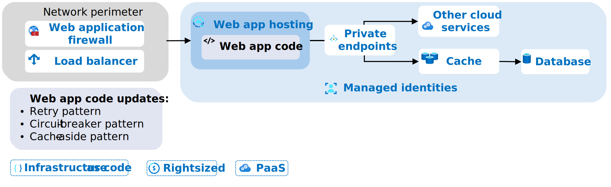

*Figure 1. Baseline architecture of the Reliable Web App pattern.*

The foundational architecture identifies the essential web components needed to support the Reliable Web App pattern implementation (*see figure 1*). The foundational architecture requires a network perimeter to protect the web app from malicious inbound traffic. The web app hosting platform connects to supporting cloud services through private endpoints to improve security. The cache supports the implementation of the Cache-Aside pattern to reduce data latency in the web app. All the Azure services behind the network perimeter use managed identities to authenticate without managing secrets. To implement the architecture updates, follow these recommendations:

- *Implement platform-as-a-service solutions.* Use platform-as-a-service (PaaS) solutions to achieve cost optimization and operational efficiency by reducing infrastructure management overhead while benefiting from built-in, cloud-optimized features that enhance reliability, security, and performance. To streamline the migration, choose services that support your current web app requirements, such as services that support the same runtime, database engine, data types, and redundancy requirements.

    | Web app component | Service selection guidance |
    | --- | --- |
    | Application platform | Start with [Azure App Service](/azure/app-service/overview) as the default application platform, and use the [compute decision tree](/azure/architecture/guide/technology-choices/compute-decision-tree) to validate your choice. |
    | Database | Use a service that allows you to keep the same database engine. Use the [data store decision tree](/azure/architecture/guide/technology-choices/data-store-decision-tree) to guide service selection. |
    | Load balancer | Web applications using PaaS solutions should use Azure Front Door, Azure Application Gateway, or both based on web app architecture and requirements. Use the [load balancer decision tree](/azure/architecture/guide/technology-choices/load-balancing-overview#decision-tree-for-load-balancing-in-azure) to pick the right load balancer(s). |
    | Storage | Review the Azure [storage options](/azure/architecture/guide/technology-choices/storage-options) to pick the right storage solution based on your requirements. |
    | Identity and access management | Use [Microsoft Entra ID](/entra/identity/enterprise-apps/migration-resources) for all identity and access management needs. |
    | Application performance monitoring | Use [Application Insights](/azure/azure-monitor/app/app-insights-overview) to analyze telemetry on your application. |
    | Cache | Use [Azure Cache for Redis](/azure/azure-cache-for-redis/cache-overview) to support the Cache-Aside pattern. |
    | Secrets manager | Use [Azure Key Vault](/azure/key-vault/general/overview) to secure all secrets. |
    | Web application firewall | Use [Azure Web Application Firewall](/azure/web-application-firewall/overview) to secure the ingress from web app attacks. |
    | Configuration storage | Use [Azure App Configuration](/azure/azure-app-configuration/overview) to store non-secret, configuration values. |
    | Endpoint security | Use [Azure Private Link](/azure/private-link/private-link-overview) to keep service communication with the virtual network. |
    | Network firewall | Use [Azure Firewall](/azure/firewall/overview) to secure traffic between spoke virtual network. |
    | Bastion host | Use [Azure Bastion](/azure/bastion/bastion-overview) to securely connect to virtual machines. |

- *Filter inbound traffic.* Force all inbound internet traffic to through the external load balancer and web application firewall to protect against common web exploits. Azure Web Application Firewall integrates with with Azure Application Gateway, Azure Front Door, and Azure Content Delivery Network (CDN).

- *Implement network topology.* Choose the right network topology for your web and networking requirements. A [hub and spoke network topology](/azure/cloud-adoption-framework/ready/azure-best-practices/hub-spoke-network-topology) is standard configuration in Azure. It provides cost, management, and security benefits with hybrid connectivity options to on-premises networks.

- *Implement infrastructure reliability.* Determine how many availability zones and regions you need to meet your availability needs. Define a target SLO for your web app, such as 99.9% uptime. Then, calculate the [composite SLA](/azure/well-architected/reliability/metrics#slos-and-slas) for all the services that affect the availability of your web app. Add availability zones and regions until the composite SLA meets your SLO.

    Design your infrastructure to support your [recovery metrics](/azure/well-architected/reliability/metrics#recovery-metrics), such as recovery time objective (RTO) and recovery point objective (RPO). The RTO affects availability and must support your SLO. Determine an recovery point objective (RPO) and configure [data redundancy](/azure/well-architected/reliability/redundancy#data-resources) to meet the RPO.

- *Implement private endpoints.* Use [private endpoints](/azure/architecture/framework/security/design-network-endpoints) in all production environments for all supported Azure services. Private endpoints help secure access to PaaS services and don't require any code changes, app configurations, or connection strings.