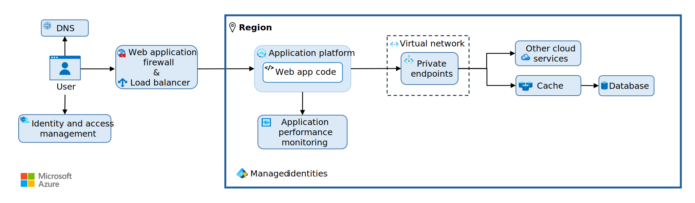
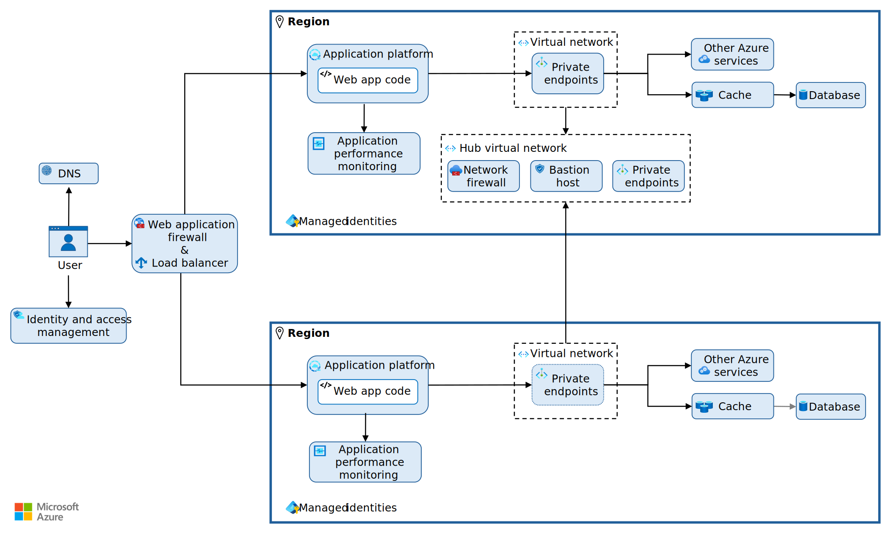

The Reliable Web App pattern has a few essential architectural elements. You need Domain Name System (DNS) to manage endpoint resolution, a web application firewall to block malicious HTTP traffic, and a load balancer to route and help protect inbound user requests. The application platform hosts your web app code and makes calls to all the back-end services through private endpoints in a virtual network. An application performance monitoring tool captures metrics and logs to help you understand your web app.

*Figure 1. Essential architectural elements of the Reliable Web App pattern.*

### Design the architecture

Design your infrastructure to support your [recovery metrics](/azure/well-architected/reliability/metrics#recovery-metrics), like your recovery time objective (RTO) and recovery point objective (RPO). The RTO affects availability and must support your SLO. Determine an RPO and configure [data redundancy](/azure/well-architected/reliability/redundancy#data-resources) to meet the RPO.

- *Choose infrastructure reliability.* Determine how many availability zones and regions you need to meet your availability requirements. Add availability zones and regions until the composite SLA meets your SLO. The Reliable Web App pattern supports multiple regions for an active-active or active-passive configuration. For example, the reference implementation uses an active-passive configuration to meet an SLO of 99.9%.

    For a multi-region web app, configure your load balancer to route traffic to the second region to support either an active-active or active-passive configuration, depending on your business need. The two regions require the same services, except one region has a hub virtual network that connects the regions. Adopt a hub-and-spoke network topology to centralize and share resources, such as a network firewall. If you have virtual machines (VMs), add a bastion host to the hub virtual network to manage them with enhanced security. (*See figure 2.*)

    

    *Figure 2. The Reliable Web App pattern with a second region and a hub-and-spoke topology.*

- *Select a network topology.* Choose the right network topology for your web and networking requirements. If you plan to use multiple virtual networks, use a [hub-and-spoke network topology](/azure/cloud-adoption-framework/ready/azure-best-practices/hub-spoke-network-topology). It provides cost, management, and security benefits and hybrid connectivity options to on-premises and virtual networks.
