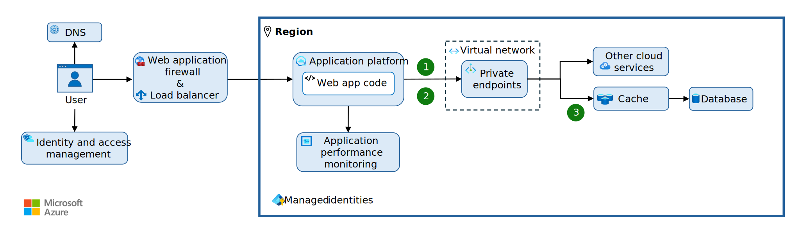

To successfully move a web app to the cloud, you need to update your web app code with the Retry pattern, Circuit-Breaker pattern, and Cache-Aside design patterns.

*Figure 3. Role of the design patterns.*

Each design pattern provides workload design benefits that align with one of more pillars of the Well-Architected Framework. Here's an overview of the patterns you should implement:

- *Retry pattern*: The Retry pattern handles transient failures by retrying operations that might fail intermittently. (**1**) Implement this pattern on all outbound calls to other Azure services.
- *Circuit Breaker pattern*: The Circuit Breaker pattern prevents an application from retrying operations that aren't transient. (**2**) Implement this pattern in all outbound calls to other Azure services.
- *Cache-Aside pattern*: The Cache-Aside pattern adds and retrieves from a cache instead of a datastore. (**3**) Implement this pattern on requests to the database.

|Design pattern|Reliability|Security|Cost Optimization|Operational Excellence|Performance Efficiency|
|---|---|---|---|---|---|
| [Retry pattern](#implement-the-retry-pattern) |✔| | | | |
| [Circuit-Breaker pattern](#implement-the-circuit-breaker-pattern) |✔| | | |✔|
| [Retry pattern](#implement-the-cache-aside-pattern) |✔| | | |✔|