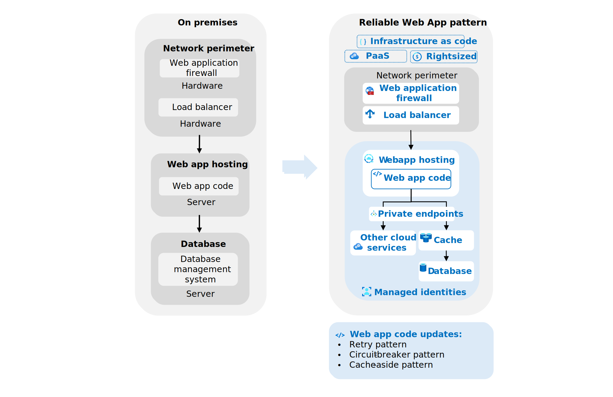

This article shows you how to implement the Reliable Web App pattern. The Reliable Web App pattern defines how you should modify web apps (replatform) when migrating to the cloud. It aligns with the principles of the [Well-Architected Framework](/azure/well-architected/).

The Reliable Web App pattern focuses on the essential changes you need to make to be successful in the cloud. These changes include three design patterns and other key updates to your web app.

:::row:::
    :::column:::
        **Benefits** 
        Cloud-ready web app\
        Minimal code changes
    :::column-end:::

    :::column:::
      **Design patterns** 
        Retry\
        Circuit-breaker\
        Cache-aside
    :::column-end:::

    :::column:::
      **Key updates** 
        Managed identity\
        Private endpoints\
        Infrastructure as code\
    :::column-end:::
:::row-end:::

To implement the Reliable Web App Pattern, follow these steps:

1. Choose the right Azure services for your web app.
1. Design web app architecture.
1. Update web app code and configurations.