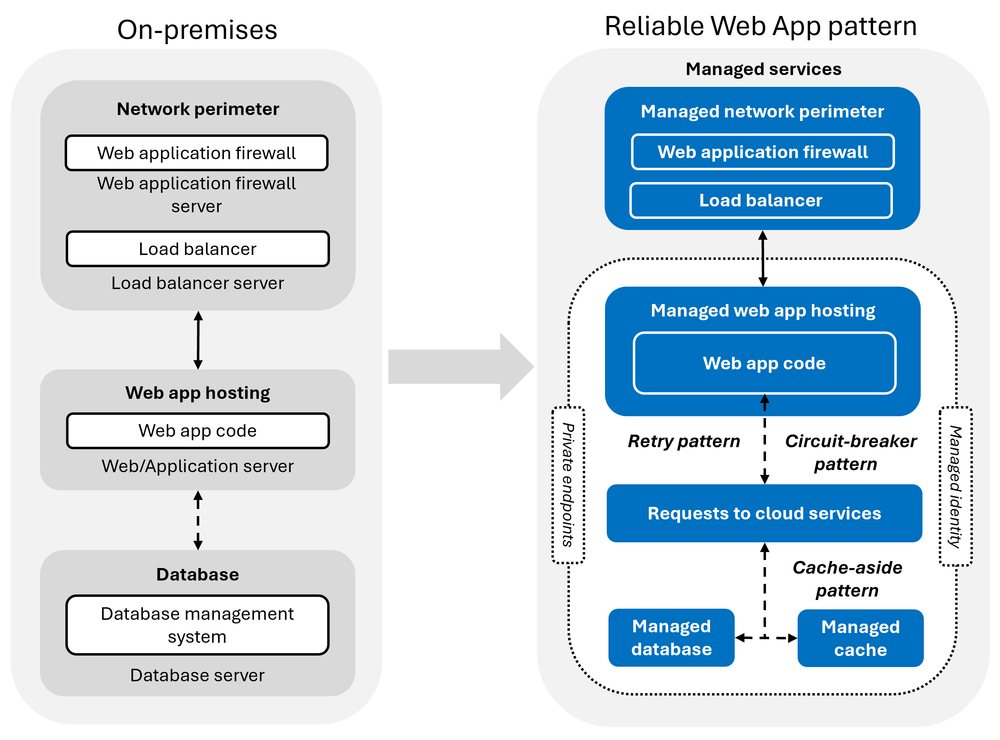

This article shows you how to implement the Reliable Web App pattern. The Reliable Web App pattern defines how you should modify web apps (replatform) when migrating to the cloud. It aligns with the principles of the [Well-Architected Framework](/azure/well-architected/) and focuses on the essential changes you need to make to be successful in the cloud. These changes include three design patterns and other key updates to your web app.

:::row:::
    :::column:::
        **Benefits** 
        Cloud-ready web app\
        Minimal code changes
    :::column-end:::

    :::column:::
      **Design patterns** 
        Retry\
        Circuit-breaker\
        Cache-aside\
    :::column-end:::

    :::column:::
      **Key updates** 
        Managed identity\
        Private endpoints\
        Infrastructure as code\
    :::column-end:::
:::row-end:::

The first step to implement the Reliable Web App pattern is choosing the right Azure services for your web app. With the right services, you can start to design your web app architecture to meet your availability and recovery metrics. Finally, update your web app code and configurations to align with the pillars of the Well-Architected Framework.