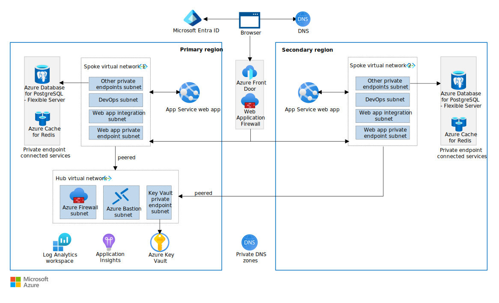

The reliable web app pattern provides essential guidance on how to move web apps to the cloud. The pattern is a set of principles and implementation techniques. They define how you should update (replatform) your web app to be successful in the cloud.

This article provides code and architecture guidance for the reliable web app pattern. The companion article provides **[implementation planning guidance](plan-implementation.yml)**. There's a **[reference implementation](https://github.com/Azure/reliable-web-app-pattern-java#reliable-web-app-pattern-for-java)** in GitHub that you can deploy.

## Architecture

[](../../_images/reliable-web-app-java.svg#lightbox)
*Figure 1. Target reference implementation architecture. Download a [Visio file](https://arch-center.azureedge.net/reliable-web-app-java.vsdx) of this architecture. For the estimated cost of this architecture, see the [production environment cost](https://azure.com/e/4e27d768a5924e3d93252eeceb4af4ad) and [nonproduction environment cost](https://azure.com/e/1721b2f3f2bd4340a00115e79057177a).*

## Reliability

The reliable web app pattern introduces two key design patterns at the code level to enhance reliability: the Retry pattern and the Circuit Breaker pattern.

### Use the Retry pattern

The [Retry pattern](/azure/architecture/patterns/retry) addresses temporary service disruptions, termed [transient faults](/azure/architecture/best-practices/transient-faults), which usually resolve within seconds. These faults often result from service throttling, dynamic load distribution, and network issues in cloud environments. Implementing the Retry pattern involves resending failed requests, allowing configurable delays and attempts before throwing an exception.

Use [Resilience4j](https://github.com/resilience4j/resilience4j) to implement the Retry pattern in Java. Resilience4j is a lightweight, fault-tolerance library. It provides higher-order functions (decorators) to enhance functional interfaces, lambda expressions, and method references with a Circuit Breaker, Rate Limiter, Retry, or Bulkhead design pattern.

*Reference implementation:* The reference implementation adds the Retry pattern by decorating a lambda expression with the Retry annotations. The code retries the call to get the media file from disk. The following code demonstrates how to use Resilience4j to retry a call to Azure Files to get the last modified time.

```java
private MediaFile checkLastModified(MediaFile mediaFile, MusicFolder folder, boolean minimizeDiskAccess) {
    Retry retry = retryRegistry.retry("media");
    CheckedFunction0<MediaFile> supplier = () -> doCheckLastModified(mediaFile, folder, minimizeDiskAccess);
    CheckedFunction0<MediaFile> retryableSupplier = Retry.decorateCheckedSupplier(retry, supplier);
    Try<MediaFile> result = Try.of(retryableSupplier).recover((IOException) -> mediaFile);
    return result.get();
}
```

The code uses the retry registry to get a `Retry` object. It also uses `Try` from the Vavr library. `Try` performs error handling and recovery in Java applications. In this code, `Try` recovers from an exception and invokes another lambda expression as a fallback. The code returns the original `MediaFile` when the number of retries reaches the set maximum number. The reference implementation configures the retry properties in the `application.properties`. For more information, see the [Resilience4j documentation](https://resilience4j.readme.io/v1.7.0/docs/getting-started-3). You can [simulate the Retry pattern](https://github.com/Azure/reliable-web-app-pattern-java/blob/main/simulate-patterns.md#retry-and-circuit-break-pattern) in the reference implementation.
  
### Use the Circuit Breaker pattern

Pairing the Retry and Circuit Breaker patterns expands an application's capability to handle service disruptions that aren't related to transient faults. The [Circuit Breaker pattern](/azure/architecture/patterns/circuit-breaker) prevents an application from continuously attempting to access a non-responsive service. The Circuit Breaker pattern releases the application and avoids wasting CPU cycles so the application retains its performance integrity for end users. For more information, see [Spring Circuit Breaker](https://docs.spring.io/spring-cloud-circuitbreaker/docs/current/reference/html/#usage-documentation), and [Resilience4j documentation](https://resilience4j.readme.io/v1.7.0/docs/getting-started-3).

*Reference implementation:* You can [Simulate the Circuit Breaker pattern](https://github.com/Azure/reliable-web-app-pattern-java/blob/main/simulate-patterns.md#retry-and-circuit-break-pattern) in the reference implementation.

## Security

The reliable web app pattern uses managed identities to implement identity-centric security. Private endpoints, web application firewall, and restricted access to the web app provide a secure ingress.

### Enforce least privileges

The principle of least privilege means you should only grant users (user identities) and Azure services (workload identities) the permissions they need.

**Assign permissions to user identities.** You need to map users to roles and give the appropriate permissions to those roles. The number and type of roles you use depends on the needs of your application.

**Assign permissions to workload identities.** You should enforce the principle of least privilege for workload identities across all Azure services. Workload identity permissions are persistent. You can't provide just-in-time or short-term permissions to workload identities. You should assign only the necessary permissions to the workload identity. The underlying Azure service should only be able to perform its required functions within the workload. For example, workload identities often need to create, read, update, and delete (CRUD) operations in a database and read secrets.

There are two ways to manage access for workload identities. (1) You can control access by using Microsoft Entra role-based access control (RBAC). (2) You can also control access at the Azure-service level with access policies. You should prioritize Azure RBAC to manage permissions over Azure-service level access controls. Azure RBAC ensures consistent, granular, and auditable access control with Microsoft Entra ID that simplifies access management. For example, you need to create an identity for your web app in Microsoft Entra ID. You should use Azure RBAC to grant the least number of permissions the web app needs to function to the web app identity. For more information, see:

- [Access to Azure Storage](/azure/storage/blobs/authorize-access-azure-active-directory)
- [Access to Key Vault](/azure/key-vault/general/rbac-guide)
- [Access to Azure Database for PostgreSQL](/azure/postgresql/flexible-server/concepts-azure-ad-authentication)

### Configure user authentication and authorization

Authentication and authorization are critical aspects of web application security. *Authentication* is the process of verifying the identity of a user. *Authorization* specifies the actions a user is allowed to perform within the application. The goal is to implement authentication and authorization without weakening your security posture. To meet this goal, you need to use the features of the Azure application platform (Azure App Service) and identity provider (Microsoft Entra ID).

#### Configure user authentication

 Your web app needs to prioritize the authentication of users to help ensure the security and integrity of the application. To configure user authentication, you should use the capabilities of the web application platform. App Service enables authentication with identity providers, including Microsoft Entra ID. You should use this feature to reduce the responsibility of your code to handle user authentication. For more information, see [Authentication in App Service](/azure/app-service/overview-authentication-authorization).

*Reference implementation.* The reference implementation uses Microsoft Entra ID as the identity platform. Using Microsoft Entra ID as the identity platform requires an application registration in the primary tenant. The application registration ensures the users that get access to the web app have identities in the primary tenant. The following Terraform code explicitly enables authentication and requires authentication to access the web app.

```terraform
data "azuread_client_config" "current" {}

resource "azuread_application" "app_registration" {
  display_name     = "${azurecaf_name.app_service.result}-app"
  owners           = [data.azuread_client_config.current.object_id]
  sign_in_audience = "AzureADMyOrg"  # single tenant
}
```

The following code configures Microsoft Entra ID as the authentication provider. It uses a client secret stored in an Azure Key Vault.

```java
spring.cloud.azure.active-directory.enabled=true
spring.cloud.azure.active-directory.credential.client-id=
spring.cloud.azure.active-directory.profile.tenant-id=
spring.cloud.azure.active-directory.credential.client-secret=${airsonic-application-client-secret}
spring.cloud.azure.active-directory.authorization-clients.graph.scopes=https://graph.microsoft.com/User.Read
```

#### Integrate with the identity provider

You need to integrate the web application with the identity provider (Microsoft Entra ID) in the code to help ensure secure and seamless authentication and authorization.

The Spring Boot Starter for Microsoft Entra ID is an excellent option for integrating with Microsoft Entra ID. This starter provides a simple and efficient way to implement enhanced-security authentication at the code level. It uses the Spring Security and Spring Boot frameworks. The Spring Boot Starter for Microsoft Entra ID provides several benefits. It supports various authentication flows, automatic token management, and customizable authorization policies. It enables integration with other Spring Cloud components such as Spring Cloud Config and Spring Cloud Gateway. By using the Spring Boot Starter for Microsoft Entra ID, you can integrate Microsoft Entra ID and OAuth 2.0 authentication and authorization into the Spring Boot application without manually configuring the required libraries and settings. For more information, see [Spring Boot Starter for Microsoft Entra ID](/azure/developer/java/spring-framework/spring-boot-starter-for-azure-active-directory-developer-guide?tabs=SpringCloudAzure4x).

*Reference implementation.* The reference implementation uses the Microsoft identity platform (Microsoft Entra ID) as the identity provider for the web app. It uses the OAuth 2.0 authorization code grant to sign in a user with a Microsoft Entra account. The following XML snippet defines the two required dependencies of the OAuth 2.0 authorization code grant flow. The dependency `com.azure.spring: spring-cloud-azure-starter-active-directory` enables Microsoft Entra authentication and authorization in a Spring Boot application. The dependency `org.springframework.boot: spring-boot-starter-oauth2-client` supports OAuth 2.0 authentication and authorization in a Spring Boot application.

```xml
<dependency>
    <groupId>com.azure.spring</groupId>
    <artifactId>spring-cloud-azure-starter-active-directory</artifactId>
</dependency>
<dependency>
    <groupId>org.springframework.boot</groupId>
    <artifactId>spring-boot-starter-oauth2-client</artifactId>
</dependency>
```

For more information, see [Spring Cloud Azure support for Spring Security](https://learn.microsoft.com/azure/developer/java/spring-framework/spring-security-support).

#### Implement authentication and authorization business rules

Implementing authentication and authorization business rules involves defining the access control policies and permissions for various application functionalities and resources. You need to configure Spring Security to use Spring Boot Starter for Microsoft Entra ID. This library allows integration with Microsoft Entra ID and helps you ensure that users are authenticated securely. Configuring and enabling the Microsoft Authentication Library (MSAL) provides access to more security features. These features include token caching and automatic token refreshing.

*Reference implementation* The reference implementation creates two app roles (*User* and *Creator*). Roles translate into permissions during authorization. The *Creator* role has permissions to configure the application settings, upload videos, and create playlists. The *User* role can view the videos.

To integrate with Microsoft Entra ID, the reference implementation had to refactor the [`GlobalSecurityConfig.java`](https://github.com/Azure/reliable-web-app-pattern-java/blob/main/src/airsonic-advanced/airsonic-main/src/main/java/org/airsonic/player/security/GlobalSecurityConfig.java). `GlobalSecurityConfig.java` has the class-level annotation `@EnableWebSecurity`. `@EnableWebSecurity` enables Spring Security to locate the class and allows the class to have custom Spring Security configuration defined in any `WebSecurityConfigurer`. `WebSecurityConfigurerAdapter` is the implementation class of the `WebSecurityConfigurer` interface. Extending the `WebSecurityConfigurerAdapter` class enables endpoint authorization.

For Microsoft Entra ID, the [`AadWebSecurityConfigurerAdapter`](https://github.com/Azure/azure-sdk-for-java/blob/main/sdk/spring/spring-cloud-azure-autoconfigure/src/main/java/com/azure/spring/cloud/autoconfigure/aad/AadWebSecurityConfigurerAdapter.java) class protects the routes in a Spring application, and it extends `WebSecurityConfigurerAdapter`. To configure the specific requirements for the reference implementation, the `WebSecurityConfiguration` class in the following code extends `ADWebSecurityConfigurationAdapter`.

The `antMatchers` method enforces authorization to the specified routes. For example, users making a request to `/deletePlaylist*` must have the role `APPROLE_Creator`. The code doesn't allow users without `APPROLE_Creator` to make the request.

```java
@Configuration
public class WebSecurityConfiguration extends AadWebSecurityConfigurerAdapter {

  @Override
  protected void configure(HttpSecurity http) throws Exception {
      // Use required configuration from AadWebSecurityAdapter.configure:
      super.configure(http);
      // Add custom configuration:

      http
          .authorizeRequests()
          .antMatchers("/recover*", "/accessDenied*", "/style/**", "/icons/**", "/flash/**", "/script/**", "/error")
          .permitAll()
          .antMatchers("/deletePlaylist*", "/savePlaylist*")
          .hasAnyAuthority("APPROLE_Creator")
          .antMatchers("/**")
          .hasAnyAuthority("APPROLE_User", "APPROLE_Creator")
          .anyRequest().authenticated()
          .and()
          .addFilterBefore(aadAddAuthorizedUsersFilter UsernamePasswordAuthenticationFilter.class)
          .logout(logout -> logout
              .deleteCookies("JSESSIONID", "XSRF-TOKEN")
              .clearAuthentication(true)
              .invalidateHttpSession(true)
              .logoutSuccessUrl("/index"));
    }
    ... 
}
```

#### Express your application needs in Microsoft Entra ID

Most apps use application roles. *Application roles* are custom roles for assigning permissions to users or applications. The application code defines the application roles, and it interprets the application roles as permissions during authorization. You can define application roles as Microsoft Entra roles that the MSAL configuration can use. The Microsoft Entra roles provide the backing for the access that the application roles receive. Microsoft Entra authorizes users by using the application roles.

The `appRoles` attribute in Microsoft Entra ID defines the roles that an app can declare in the application manifest. The `appRoles` attribute allows applications to define their own roles. When a user signs in to the application, Microsoft Entra ID generates an ID token that contains various claims. This token includes a roles claim that lists the roles assigned to the user.

*Reference implementation.* The reference implementation uses an app registration to assign Microsoft Entra users an app role (*User* or *Creator*). The app roles allow users to sign in to the application. The following JSON shows what the *User* and *Creator* `appRoles` look like in Terraform.

```terraform
data "azuread_client_config" "current" {}

resource "azuread_application" "app_registration" {
  display_name     = "${azurecaf_name.app_service.result}-app"
  owners           = [data.azuread_client_config.current.object_id]
  sign_in_audience = "AzureADMyOrg"  # single tenant

  app_role {
    allowed_member_types = ["User"]
    description          = "ReadOnly roles have limited query access"
    display_name         = "ReadOnly"
    enabled              = true
    id                   = random_uuid.user_role_id.result
    value                = "User"
  }

  app_role {
    allowed_member_types = ["User"]
    description          = "Creator roles allows users to create content"
    display_name         = "Creator"
    enabled              = true
    id                   = random_uuid.creator_role_id.result
    value                = "Creator"
  }
}
```

For more information, see:

- [Register an application with the Microsoft identity platform](/azure/active-directory/develop/quickstart-register-app)
- [AppRoles attribute](/azure/active-directory/develop/reference-app-manifest#approles-attribute)
- [Spring Boot Starter for Microsoft Entra developer's guide](/azure/developer/java/spring-framework/spring-boot-starter-for-azure-active-directory-developer-guide)
- [Add sign-in with Microsoft Entra account to a Spring web app](/azure/developer/java/spring-framework/configure-spring-boot-starter-java-app-with-azure-active-directory)
- [Add app roles to your application and receive them in the token](/azure/active-directory/develop/howto-add-app-roles-in-azure-ad-apps)
- [Configurable token lifetimes in the Microsoft identity platform](/azure/active-directory/develop/active-directory-configurable-token-lifetimes)

### Configure service authentication and authorization

You need to configure user authentication and authorization so users can access the web app. You also need to configure service authentication and authorization so the services in your environment have the permissions to perform necessary functions.

**Use managed identities.** Managed identities create an identity in Microsoft Entra ID that eliminates the need for developers to manage credentials. The web app receives a workload identity (service principal) in Microsoft Entra ID. Azure manages the access tokens behind the scenes. Managed identities provide benefits for authentication, authorization, and accounting. For example, you can use a managed identity to grant the web app access to other Azure resources such as Azure Key Vault and Azure databases. You can also use a managed identity to enable a CI/CD pipeline that deploys a web app to App Service.

However, keeping your on-premises authentication and authorization configuration can improve your migration experience in some cases. For example, hybrid deployments, legacy systems, and robust on-premises identity solutions could be reasons to delay the adoption of managed identities. You should keep the on-premises setup and modernize your identity solution later. For more information, see [Managed identities for developers](/entra/identity/managed-identities-azure-resources/overview-for-developers) and [Monitoring managed identities](/entra/identity/managed-identities-azure-resources/how-to-view-managed-identity-activity).

*Reference implementation.* The reference implementation keeps the on-premises authentication mechanism for the database (username and password). As a result, the reference implementation stores the database secret in Key Vault. The web app uses a managed identity (system assigned) to retrieve secrets from Key Vault.

### Use a central secrets store to manage secrets

The term *secret* refers to anything that you don't want exposed in plain text (passwords, keys, certificates). After you migrate your app to the cloud, you might have secrets that you need to manage. You should store all these secrets in Key Vault.

For Azure services not compatible with managed identities, store application secrets in Azure Key Vault as a central repository. Azure Key Vault enables secure storage, key rotation, and access auditing of secrets. Additionally, Key Vault supports monitoring for enhanced security oversight. Store application configurations in Azure App Configuration.

*Reference implementation.* The reference implementation stores the following secrets in Key Vault: (1) PostgreSQL database username and password, (2) Redis Cache password, and (3) the client secret for Microsoft Entra ID associated with the MSAL implementation.

#### Don't put Key Vault in the HTTP-request flow

Key Vault has service limitations to safeguard resources and ensure optimal service quality for its clients. The original intent of Key Vault was to store and retrieve sensitive information during deployment. Organizations sometimes use Key Vault for runtime secret management, and many applications and services treat it like a database. However, the Key Vault limitations don't support high throughput rates and might affect performance if Key Vault is in the HTTP-request flow. When a key vault reaches a service threshold, it limits any further requests from the client and returns HTTP status code 429. The web app should load values from Key Vault at application start time. For more information, see [Key Vault transaction limits](/azure/key-vault/general/service-limits#secrets-managed-storage-account-keys-and-vault-transactions).

#### Use one method to access secrets in Key Vault

There are two methods to configure a web app to access secrets in Key Vault. (1) You can use an app setting in App Service and inject the secret as an [environment variable](/azure/app-service/app-service-key-vault-references#azure-resource-manager-deployment). (2) You can reference the secret in your application code. Add a reference to the app properties file so the app can communicate with Key Vault. You should pick one of these two methods and use it consistently. You should also avoid using both methods because it creates unneeded complexity.  

To integrate Key Vault with a Spring application, you need to (1) add the Azure Spring Boot Starter For Azure Key Vault Secrets in the `pom.xml` file and (2) configure a Key Vault endpoint in either the `application.properties` file or as an environment variable.

*Reference implementation.* The reference implementation uses the following code to add the Azure Spring Boot Starter For Azure Key Vault Secrets in the `pom.xml`:

```xml
<dependency> 
    <groupId>com.azure.spring</groupId> 
    <artifactId>spring-cloud-azure-starter-keyvault</artifactId> 
</dependency> 
```

The reference implementation uses an environment variable in the [App Service Terraform](https://github.com/Azure/reliable-web-app-pattern-java/blob/main/terraform/modules/app-service/main.tf) file to configure the Key Vault endpoint. The following code shows the environment variable.

```terraform
SPRING_CLOUD_AZURE_KEYVAULT_SECRET_PROPERTY_SOURCES_0_ENDPOINT=var.key_vault_uri
```

The reference implementation sets the property `spring.cloud.azure.keyvault.secret.property-source-enabled` to `true` in the `application.properties` file. This property allows Spring Cloud Azure to inject secrets from Azure Key Vault. The `${database-app-user-password}` is an example of Spring Cloud Azure injecting a secret into the web application.

```java
spring.cloud.azure.keyvault.secret.property-source-enabled=true

spring.datasource.driver-class-name=org.postgresql.Driver
spring.datasource.url=
spring.datasource.username=${database-app-user}
spring.datasource.password=${database-app-user-password}
```

#### Avoid using access keys for temporary access where possible

Granting permanent access to a storage account is a security risk. If attackers obtain the access keys, they have permanent access to your data. It's a best practice to use temporary permissions to grant access to resources. Temporary permissions reduce the risk of unauthorized access or data breaches.

For temporary account access, you should use a shared access signature (SAS). There's a user delegation SAS, a service SAS, and an account SAS. You should use a user delegation SAS when possible. It's the only SAS that uses Microsoft Entra credentials and doesn't require a storage account key.

*Reference implementation.* Sometimes access keys are unavoidable. The reference implementation needs to use a [Storage account access key](/azure/storage/common/storage-account-keys-manage) to mount a directory with Azure Files to App Service. The web app uses the Azure Files integration in App Service to mount an NFS share to the Tomcat app server. The mount allows the web app to access the file share as if it were a local directory. This setup enables the web app to read and write files to the shared file system in the cloud.

### Use private endpoints

Private endpoints provide private connections between resources in an Azure virtual network and Azure services. By default, communication to most Azure services crosses the public internet. You should use private endpoints in all production environments for all supported Azure services. Private endpoints don't require any code changes, app configurations, or connection strings. For more information, see [How to create a private endpoint](/azure/architecture/example-scenario/private-web-app/private-web-app#deploy-this-scenario) and [Best practices for endpoint security](/azure/architecture/framework/security/design-network-endpoints).

*Reference implementation.* The reference implementation uses private endpoints for Key Vault, Azure Cache for Redis, and Azure Database for PostgreSQL. The reference implementation doesn't use a private endpoint for Azure Files for deployment purposes. The web app needs to load the user interface with playlists and videos from the local client IP address. A private endpoint would block this deployment step. So we opted for a service firewall. Azure Files only accepts traffic from the virtual network and the local client IP of the user executing the deployment. Since you don't need to populate data like this in production, you should use a private endpoint.

### Use a web application firewall

All inbound internet traffic to the web app must pass through a web application firewall to protect against common web exploits. Force all inbound internet traffic to pass through the public load balancer, if you have one, and the web application firewall. You can (1) [use Azure Front Door private endpoint](/azure/frontdoor/private-link), or (2) you can filter requests by the `X-Azure-FDID` header value. The App Service platform and Java Spring can filter by header value. You should use App Service as the first option. Filtering at the platform level prevents unwanted requests from reaching your code. You need to configure what traffic you want to pass through your WAF. You can filter based on the host name, client IP, and other values. For more information, see [Preserve the original HTTP host name](/azure/architecture/best-practices/host-name-preservation)

*Reference implementation.* The reference implementation filters requests to ensure they pass through the WAF. It uses a native network control in App Service that looks for a specific `X-Azure-FDID` value.

```terraform
resource "azurerm_linux_web_app" "application" {

    site_config {

        ip_restriction {
           service_tag               = "AzureFrontDoor.Backend"
          ip_address                = null
          virtual_network_subnet_id = null
          action                    = "Allow"
          priority                  = 100
          headers {
            x_azure_fdid      = [var.frontdoor_profile_uuid]
            x_fd_health_probe = []
            x_forwarded_for   = []
            x_forwarded_host  = []
          }
          name = "Allow traffic from Front Door"
        }
    }
}
```

### Configure database security

Administrator-level access to the database grants permissions to perform privileged operations. Privileged operations include creating and deleting databases, modifying table schemas, or changing user permissions. Developers often need administrator-level access to maintain the database or troubleshoot issues.

- *Avoid permanent elevated permissions.* You should only grant the developers just-in-time access to perform privileged operations. With just-in-time access, users receive temporary permissions to perform privileged tasks

- *Don't give application elevated permissions.** You shouldn't grant administrator-level access to the application identity. You should configure least-privileged access for the application to the database. It limits the blast radius of bugs and security breaches. You have two primary methods to access the Azure PostgreSQL database. You can use Microsoft Entra authentication or PostgreSQL authentication. For more information, see [JDBC with Azure PostgreSQL](/azure/developer/java/spring-framework/configure-spring-data-jdbc-with-azure-postgresql).

## Cost optimization

The reliable web app pattern implements rightsizing techniques, autoscaling, and efficient resource usage for a more cost optimized web app.

*Reference implementation.* The app uses Azure Files integrated with App Service to save training videos that users upload. Refactoring this integration to use Azure Storage blobs would reduce hosting costs and should be evaluated as a possible future modernization.

### Rightsize resources for each environment

Understand the different performance tiers of Azure services and only use the appropriate SKU for the needs of each environment. Production environments need SKUs that meet the service level agreements (SLA), features, and scale needed for production. Nonproduction environments typically don't need the same capabilities. For extra savings, consider [Azure Dev/Test pricing options](https://azure.microsoft.com/pricing/dev-test/#overview), [Azure Reservations](/azure/cost-management-billing/reservations/save-compute-costs-reservations), and [Azure savings plans for compute](/azure/cost-management-billing/savings-plan/savings-plan-compute-overview).

*Reference implementation.* This architecture doesn't apply Azure Dev/Test pricing. Azure Dev/Test pricing didn't cover any of the components. Azure Database for PostgreSQL is a prime candidate for a reserved instance based on the plan to stick with this database engine for at least a year after this initial convergence on the cloud phase. The reference implementation has an optional parameter that deploys different SKUs. An environment parameter instructs the Terraform template to select development SKUs. The following code shows this environment parameter.

```shell
azd env set APP_ENVIRONMENT prod
```

Proseware uses the same infrastructure-as-code (IaC) templates for development and production deployments. The only difference is a few SKU differences to optimize cost in the development environment. Proseware chose to use cheaper SKUs in the development environment for Azure Cache for Redis, App Service, and Azure Database for PostgreSQL Flexible Server. The following table shows the services and the SKUs Proseware chose for each environment. You should choose SKUs that meet the needs of each environment.

### Use autoscale

Autoscale automates horizontal scaling for production environments. Autoscale based on performance metrics. CPU utilization performance triggers are a good starting point if you don't understand the scaling criteria of your application. You need to configure and adapt scaling triggers (CPU, RAM, network, and disk) to correspond to the behavior of your web application. Don't scale vertically to meet frequent changes in demand. It's less cost efficient. For more information, see [Scaling in Azure App Service](/azure/app-service/manage-scale-up) and [Autoscale in Microsoft Azure](/azure/azure-monitor/autoscale/autoscale-overview).

### Use resources efficiently

- *Use shared services.* Centralizing and sharing certain resources provides cost optimization and lower management overhead. Place shared network resources in the hub virtual network.
- *Delete unused environments.* Delete nonproduction environments after hours or during holidays to optimize cost. You can use infrastructure as code to delete Azure resources and entire environments. Remove the declaration of the resource that you want to delete from the Bicep template. Use the what-if operation to preview the changes before they take effect. Back up data you need later. Understand the dependencies on the resource you're deleting. If there are dependencies, you might need to update or remove those resources as well.
- *Colocate functionality.* Where there's spare capacity, colocate application resources and functionality on a single Azure resource. For example, multiple web apps can use a single server (App Service Plan) or a single cache can support multiple data types.

## Operational excellence

The reliable web app pattern implements infrastructure as code for infrastructure deployments and monitoring for observability.

### Configure monitoring

For tracing and debugging, you should enable logging to diagnose when any request fails. The telemetry you gather from your application should cater to its operational needs. At a minimum, you must collect telemetry on baseline metrics. You should gather information on user behavior that can help you apply targeted improvements.

#### Monitor baseline metrics

The workload should monitor baseline metrics. Important metrics to measure include request throughput, average request duration, errors, and monitoring dependencies. We recommend that you use Application Insights to gather this telemetry.

*Reference implementation.* The reference implementation demonstrates how to programmatically enable Application Insights. To enable Application Insights, you need to add the following Maven dependency to the `pom.xml` file.

   ```xml
   <dependency>
      <groupId>com.microsoft.azure</groupId>
      <artifactId>applicationinsights-runtime-attach</artifactId>
      <version>3.4.12</version>
   </dependency>
   ```

This dependency adds the necessary Application Insights components to your application build. It allows you to visualize metrics in Azure Application Insights. Spring Boot registers several core metrics in Application Insights such as Java virtual machine (JVM), CPU, Tomcat, and others. Application Insights automatically collects from logging frameworks such as Log4j and Logback. For more information, see:

- [Configure Azure Monitor Application Insights for Spring Boot](/azure/azure-monitor/app/java-spring-boot#enabling-programmatically)
- [Configuration options - Azure Monitor Application Insights for Java - Azure Monitor](/azure/azure-monitor/app/java-standalone-config#auto-collected-logging)
- [Enable Azure Monitor OpenTelemetry for Java applications](https://learn.microsoft.com/azure/azure-monitor/app/java-in-process-agent)
- [Using Azure Monitor Application Insights with Spring Boot](https://learn.microsoft.com/azure/azure-monitor/app/java-spring-boot).

#### Create custom telemetry and metrics as needed

In addition to the baseline metrics in Application Insights, you should create custom telemetry to better understand your users and their interactions with your application. Application Insights allows you to gather custom telemetry, and you can also collect custom metrics through Micrometer. The goal is to gain deeper insights into your application's performance and user behavior, so you can make more informed decisions and improvements.

#### Gather log-based metrics

Track log-based metrics to gain more visibility into essential application health and metrics. You can use [Kusto Query Language (KQL)](/azure/data-explorer/kusto/query/) queries in Application Insights to find and organize data. For more information, see [Azure Application Insights log-based metrics](/azure/azure-monitor/essentials/app-insights-metrics) and [Log-based and preaggregated metrics in Application Insights](/azure/azure-monitor/app/pre-aggregated-metrics-log-metrics).

#### Enable platform diagnostics

A diagnostic setting in Azure allows you to specify the platform logs and metrics you want to collect and where to store them. Platform logs are built-in logs that provide diagnostic and auditing information. You can enable platform diagnostics for most Azure services, but each service defines its own log categories. Different Azure services have log categories to choose.

- *Enable diagnostics for all supported services.* Azure services create platform logs automatically, but the service doesn't store them automatically. You must enable the diagnostic setting for each service, and you should enable it for every Azure service that supports diagnostics.

- *Send diagnostics to same destination as the application logs.* When you enable diagnostics, you pick the logs you want to collect and where to send them. You should send the platform logs to the same destination as the application logs so you can correlate the two datasets.

*Reference implementation.* The reference implementation uses Terraform to enable Azure diagnostics on all supported services. The following Terraform code configures the diagnostic settings for the PostgreSQL database.

```terraform
# Configure Diagnostic Settings for PostgreSQL
resource "azurerm_monitor_diagnostic_setting" "postgresql_diagnostic" {
  name                           = "postgresql-diagnostic-settings"
  target_resource_id             = azurerm_postgresql_flexible_server.postresql_database.id
  log_analytics_workspace_id     = var.log_analytics_workspace_id

  enabled_log {
    category_group = "allLogs"

    retention_policy {
      days    = 0
      enabled = false
    }
  }
}
```

### Use a CI/CD pipeline

You should use a CI/CD pipeline to automate deployments from source control to your App Service environments (test, staging, production). If you use Azure DevOps, build your pipeline with Azure Pipelines. If you use GitHub, use GitHub actions. Your pipeline should follow standard best practices.

**Use unit (JUnit) tests.** Your pipeline should execute and pass all unit (JUnit) tests before deploying the changes to the App Service. We recommend using code quality and code coverage tools in your pipeline to ensure you test enough of your code. It includes tools such as SonarQube, JaCoCo, and others.

**Use a Java mocking framework.** You should use a mocking framework (Mockito, Easy Mock, or other Java implementations) to simulate tests on external endpoints. With mocking frameworks, you don't need to hard-code tests to specific external endpoints. Instead, you use simulated (mock) endpoints. By simulating the endpoints, you don't need to set up and configure actual external endpoints for testing. The result is a consistent testing experience across different environments.

**Scan code for security vulnerabilities.** The build pipeline should conduct security checks. You should use static code analysis testing (SAST) to identity security vulnerability and coding errors in the application source code. You need to do a software composition analysis (SCA) to scan third-party libraries and components for security vulnerabilities. Both GitHub and Azure DevOps provide native support for these security tools and make them easy to integrate into your pipeline.

**Govern production deployments.** You need to establish guidelines for deploying code to production and create an approval process for all production deployments.

## Performance efficiency

The reliable web app pattern uses the Cache-Aside pattern to minimize the latency for highly requested data.

### Use the Cache-Aside pattern

The [Cache-Aside pattern](/azure/architecture/patterns/cache-aside) is a caching strategy that improves in-memory data management. The pattern assigns the application the responsibility of handling data requests and ensuring consistency between the cache and a persistent storage, such as a database. When the web app receives a data request, it first searches the cache. If the data is missing, it retrieves it from the database, responds to the request, and updates the cache accordingly. This approach shortens response times and enhances throughput and reduces the need for more scaling. It also bolsters service availability by reducing the load on the primary datastore and minimizing outage risks.

#### Enable caching

To enable caching, you must add the `spring-boot-starter-cache` package as a dependency in your `pom.xml` file. The `spring-boot-starter-cache` package configures the Redis cache with default values. You should update those values in `application.properties` file or the environment variables to meet the needs of your web app. For example, the `spring.cache.redis.time-to-live` (represented in milliseconds) determines the amount of time that data remains in the cache before eviction. You need to provide a value that meets the needs of your web app. Finally, you need to cache the required data in your code by using the `@Cacheable` annotation.

#### Cache high-need data

Prioritize caching for the most frequently accessed data. Identify key data points that drive user engagement and system performance. Implement caching strategies specifically for these areas to optimize the effectiveness of the Cache-Aside pattern, significantly reducing latency and database load. Use Azure Monitor to track the CPU, memory, and storage of the database. These metrics help you determine whether you can use a smaller database SKU.

#### Keep cache data fresh

Schedule regular cache updates to sync with the latest database changes. Determine the optimal refresh rate based on data volatility and user needs. This practice ensures the application uses the Cache-Aside pattern to provide both rapid access and current information.

#### Ensure data consistency

Implement mechanisms to update the cache immediately after any database write operation. Use event-driven updates or dedicated data management classes to ensure cache coherence. Consistently synchronizing the cache with database modifications is central to the Cache-Aside pattern.

*Reference implementation:* The following code adds the `spring-boot-starter-cache` package as a dependency to the `pom.xml` file to enable caching.

```xml
<dependency>
    <groupId>org.springframework.boot</groupId>
    <artifactId>spring-boot-starter-cache</artifactId>
</dependency>
```

The reference implementation provides explicit values for the Redis properties in the `application.properties` file to override the default settings from the starter cache package.

```java
spring.redis.password=${redis-password}
spring.redis.ssl=true
spring.cache.type=redis
spring.cache.redis.time-to-live=40000 
```

The following code defines a method called `getUserSettings`. The method retrieves the user settings associated with a given username. The `@Cacheable(cacheNames = "userSettingsCache")` annotates the `getUserSettings` method and tells the web app to cache the user settings in a cache called `userSettingsCache`.

```java
@Cacheable(cacheNames = "userSettingsCache")
public UserSettings getUserSettings(String username) {
    UserSettings settings = userDao.getUserSettings(username);
    return settings == null ? createDefaultUserSettings(username) : settings;
}
```

### Database performance

Database performance can affect the performance and scalability of an application. It's important to test the performance of your database to ensure it's optimized. Some key considerations include choosing the right cloud region, connection pooling, cache-aside pattern, and optimizing queries.

- *Test network hops.* Moving an application to the cloud can introduce extra network hops and latency to your database. You should test for extra hops that the new cloud environment introduces.

- *Establish a performance baseline.* You should use on-premises performance metrics as the initial baseline to compare application performance in the cloud.

- *Use Application Insights.* Application Insights provides detailed metrics on database queries and any JDBC interfaces. You should use it to ensure a ported database is meeting its SLAs or to find queries that need tuning. You should never use Dynamic SQL because it creates security and performance issues.

- *Use connection pools.* You should use JDBC connection pools and fine-tune them based on the transactions per second (TPS) metrics and SLAs. You should use database performance monitoring tools to test and evaluate database performance under load.

### Mounted storage performance

When you use a mounted storage solution for your web applications, such as Azure Files, it's important to choose a storage tier that meets the input/output operations per second (IOPS) requirements of your application. Azure Files offers different performance tiers with varying IOPS capabilities and costs. Make sure to select the appropriate tier to ensure the best performance and cost-optimization for your web application.

## Next steps

Deploy the **[reference implementation](https://github.com/Azure/reliable-web-app-pattern-java#reliable-web-app-pattern-for-java) by following the instructions in the GitHub repository. Use the following resources to learn more about cloud best practices and migration.

**Cloud best practices.** For Azure adoption and architectural guidance, see:

- [Cloud Adoption Framework](/azure/cloud-adoption-framework/overview). A framework to help your organization prepare and execute a strategy to build solutions on Azure.
- [Well-Architected Framework](/azure/architecture/framework/). A set of guiding tenets that you can use to improve the quality of a workload.

For applications that require a higher service level objective (SLO), see [mission-critical workloads](/azure/architecture/framework/mission-critical/mission-critical-overview).

**Migration guidance.** The following tools and resources can help you migrate on-premises resources to Azure:

- [Azure Migrate](/azure/migrate/migrate-services-overview) provides a simplified migration, modernization, and optimization service for Azure that handles assessment and migration of web apps, SQL Server, and virtual machines.
- [Azure Database Migration Guides](/data-migration/) provides resources for various database types, and tools designed for your migration scenario.
- [Azure App Service landing zone accelerator](/azure/cloud-adoption-framework/scenarios/app-platform/app-services/landing-zone-accelerator) provides guidance for hardening and scaling App Service deployments.
