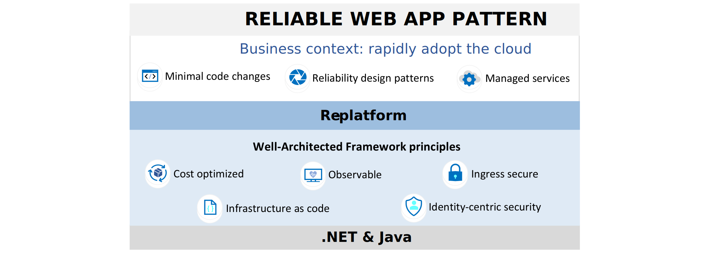

# Reliable web app pattern

The reliable web app pattern provides essential implementation guidance for web apps moving to the cloud. It defines how you should update (re-platform) your web app to be successful in the cloud. The reliable web app pattern focuses on minimal code changes, reliability design patterns, and managed services so you can rapidly adopt the cloud (*see figure 1*).

*Figure 1. Overview of the reliable web app pattern.*

The reliable web app pattern builds on the principles of the Azure Well-Architected Framework. It focuses on several well-architected principles that are essential for the entire cloud adoption journey. The reliable web app pattern helps ensure web apps are cost optimized, observable, and ingress secure. The pattern also shows you how to implement infrastructure as code and identity-centric security.

## Next steps

There's specific implementation guidance for .NET and Java web apps. There's a reference implementation (sample web app) for both .NET and Java. The reference implementation has the reliable web app pattern applied. You should follow right guidance for your web app and use the reference implementation to expedite your progress.

>[!div class="nextstepaction"]
>[Reliable web app pattern for .NET](./dotnet/plan-implementation.yml)

>[!div class="nextstepaction"]
>[Reliable web app pattern for Java](./java/plan-implementation.yml)
