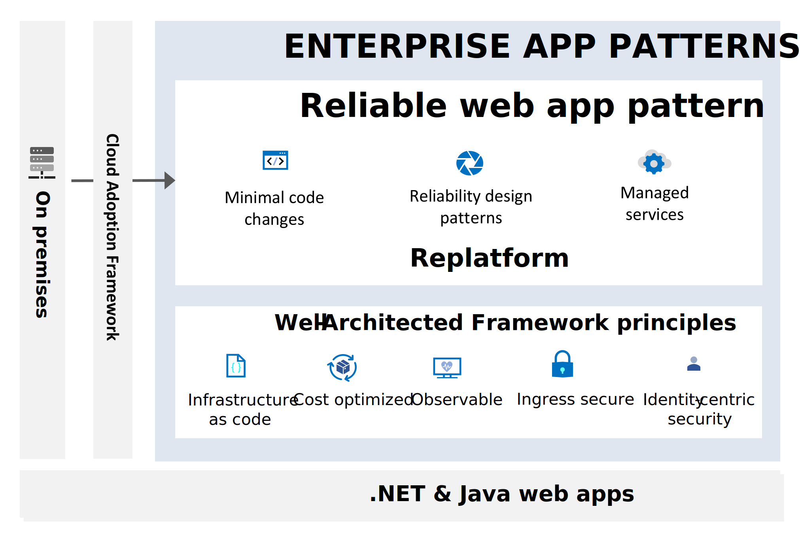

# Reliable Web App pattern

The Reliable Web App pattern aims to streamline the process of moving web applications to the cloud. It provides a systematic method for quickly adopting cloud technologies for on-premises web applications. Organizations migrating to the cloud should follow the Cloud Adoption Framework and establish a [landing zone](/azure/cloud-adoption-framework/ready/landing-zone/) for their web applications. The Reliable Web App pattern details strategies for replatforming your web application to ensure a successful migration to the cloud.

## Principles and implementation techniques

The [Well-Architected Framework](/azure/well-architected/pillars) establishes the overriding principles of the Reliable Web App pattern. The Reliable Web App pattern goes beyond these original principles to derive subordinate principles specific to the process of migrating web apps to the cloud. Within these principles, the Reliable Web App Pattern focuses on making minimal code changes, applying reliability design patterns, and using managed services. It helps you create a web app that is cost optimized, observable, and ingress secure using infrastructure as code and identity-centric security.

| Reliable Web App pattern principles | Implementation techniques |
| --- | --- |
|  ▪ Minimal code changes ▪ Reliability design patterns ▪ Managed services ▪ Cost optimized ▪ Observable ▪ Ingress secure ▪ Infrastructure as code ▪ Identity-centric security|▪ Retry pattern   ▪ Circuit-breaker pattern  ▪ Cache-aside pattern  ▪ Rightsized resources  ▪ Managed identities  ▪ Private endpoints  ▪ Secrets management  ▪ Bicep (.NET) and Terraform (Java) deployment  ▪ Telemetry, logging, monitoring |

## Web app architecture

It's important to note that the Reliable Web App pattern isn't a one-size-fits-all set of services or a specific architecture. The unique needs of your business and the characteristics of your existing web application are crucial in determining the most suitable architecture and network topology.

## Next steps

There's Reliable Web App pattern guidance for .NET and Java web applications. Use the guidance and reference implementations to accelerate your move to Azure.

>[!div class="nextstepaction"]
>[Reliable Web App pattern for .NET](./dotnet/plan-implementation.yml)

>[!div class="nextstepaction"]
>[Reliable Web App pattern for Java](./java/plan-implementation.yml)
