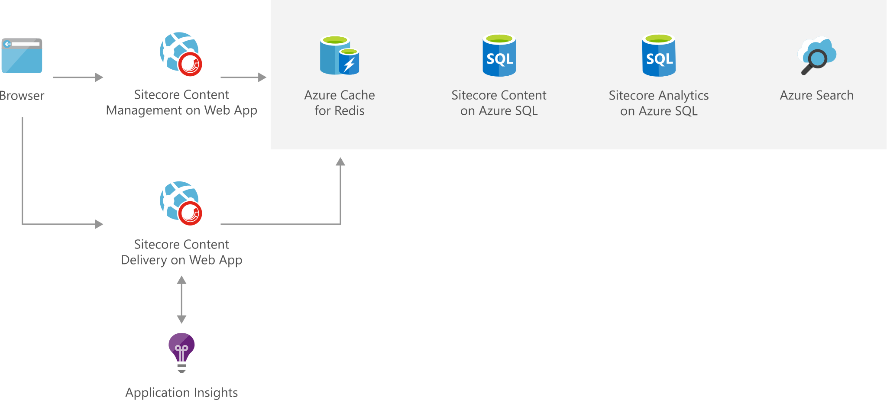

[!INCLUDE [header_file](../../../includes/sol-idea-header.md)]

With the Sitecore Experience Platform (xP), you have at your fingertips the complete data, integrated tools, and automation capabilities to engage your customers throughout an iterative life cycle-the technology foundation necessary to win customers for life.

This solution is built on the Azure managed services: [Azure SQL Database](https://azure.microsoft.com/services/sql-database), [Azure Cache for Redis](https://azure.microsoft.com/services/cache), [Azure Cognitive Search](https://azure.microsoft.com/services/search), and [Azure Monitor](https://azure.microsoft.com/services/monitor). These services run in a high-availability environment, patched and supported, allowing you to focus on your solution instead of the environment they run in.

## Potential use cases

This solution is used across multiple industries to improve customer experience and engagement.

## Architecture

*Download an [SVG](images/digital-marketing-sitecore.svg) of this architecture.*

### Components

* App Service [Web Apps](https://azure.microsoft.com/services/app-service/web) runs in multiple regions, accessible to web and mobile browsers, and is scaled out across multiple server instances. Used by Sitecore to host its content delivery, content management, reporting, and processing roles.
* [Azure SQL Database](https://azure.microsoft.com/services/sql-database): A SQL Database instance stores and serves data about the site.
* [Azure Cache for Redis](https://azure.microsoft.com/services/cache) enables fast queries, and improves scalability by reducing the load on the main database. Sitecore's Session State session state is managed by [Azure Cache for Redis](https://azure.microsoft.com/services/cache).
* An [Azure Cognitive Search](https://azure.microsoft.com/services/search) service used for quick lookup of data. All Sitecore search indexes are stored in [Azure Cognitive Search](https://azure.microsoft.com/services/search) for quick lookup and scalability.
* [Azure Monitor](https://azure.microsoft.com/services/monitor) provides service health and performance monitoring, and diagnostics. [Azure Monitor](https://azure.microsoft.com/services/monitor) provides Sitecore with a solution for its health and performance monitoring needs.

## Next steps

* [Deploy an ASP.NET web app to Azure App Service, using Visual Studio](/azure/app-service/app-service-web-get-started-dotnet)
* [SQL Database tutorial: Create an SQL database in minutes by using the Azure portal](/azure/sql-database/sql-database-single-database-get-started)
* [How to create a Web App with Azure Cache for Redis](/azure/azure-cache-for-redis/cache-web-app-howto)
* [Use Azure Cognitive Search](https://azure.microsoft.com/services/search)
* [Application Performance Management with Azure Monitor](/azure/azure-monitor/app/app-insights-overview)
