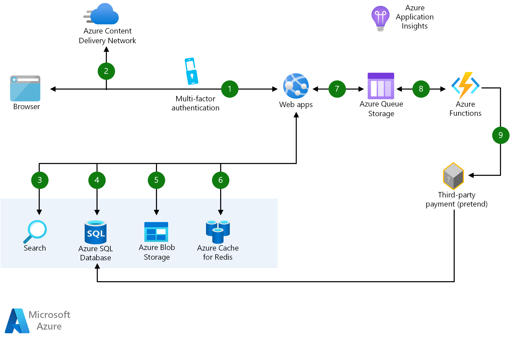

[!INCLUDE [header_file](../../../includes/sol-idea-header.md)]

Build scalable e-commerce web apps with Azure Functions and Web Apps, so you can create personalized experiences while Azure takes care of the infrastructure. This solution is ideal for the retail industry.

## Potential use cases

This solution is ideal for retail organizations, but it can apply to other industries that sell goods and services.

## Architecture

<!-- cSpell:ignore helvetica -->

*Download a [Visio file](https://arch-center.azureedge.net/scalable-ecommerce-web-app.vsdx) of this architecture.*

### Dataflow

1. User accesses the web app in browser and signs in.
1. Browser pulls static resources such as images from Azure Content Delivery Network.
1. User searches for products and queries SQL database.
1. Web site pulls product catalog from database.
1. Web app pulls product images from Blob Storage.
1. Page output is cached in Azure Cache for Redis for better performance.
1. User submits order and order is placed in the queue.
1. Azure Functions processes order payment.
1. Azure Functions makes payment to third party and records payment in SQL database.

### Components

* [Web Apps](https://azure.microsoft.com/services/app-service/web): An App Service Web App runs in a single region, accessible to web and mobile browsers
* [Azure SQL Database](https://azure.microsoft.com/services/sql-database): Managed, intelligent SQL in the cloud
* [Azure Functions](https://azure.microsoft.com/services/functions): Process events with serverless code
* Application Insights: Detect, triage, and diagnose issues in your web apps and services

## Contributors

*This article is maintained by Microsoft. It was originally written by the following contributors.*

Principal author:

 * [Andrew Harvey](https://www.linkedin.com/in/andrewharvey) | Principal Program Manager - Microsoft for Startups

## Next steps

* [Get started easily with Web Apps using the five-minute quick starts](/azure/app-service)
* [Build an ASP.NET app in Azure with SQL Database](/azure/app-service/app-service-web-tutorial-dotnet-sqldatabase)
* [Learn what can you do with Azure Functions](/azure/azure-functions/functions-overview)
* [Application Performance Management with Application Insights](/azure/application-insights/app-insights-overview)
