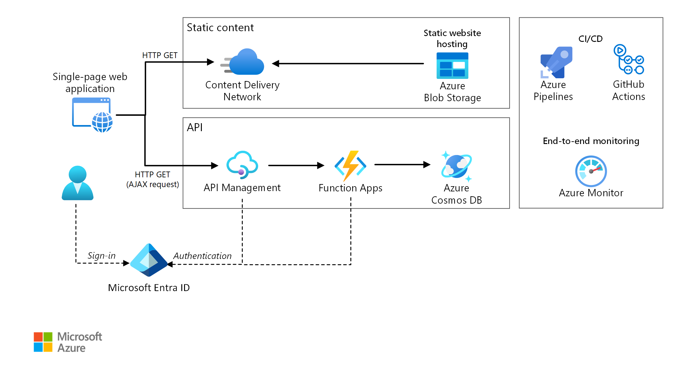

This reference architecture shows a [serverless](https://azure.microsoft.com/solutions/serverless/) web application. The application serves static content from Azure Blob Storage, and implements an API using Azure Functions. The API reads data from Azure Cosmos DB and returns the results to the web app.

 Two reference implementations for this architecture are available on GitHub: [Drone Delivery App (ARM & Azure Pipelines)][drone-delivery] and [To Do App (Bicep & GitHub Actions)][todo].

## Architecture



*Download a [Visio file](https://arch-center.azureedge.net/serverless-web-app.vsdx) of this architecture.*

The term serverless has two distinct but related meanings:

- **Backend as a service** (BaaS). Back-end cloud services, such as databases and storage, provide APIs that enable client applications to connect directly to these services.
- **Functions as a service** (FaaS). In this model, a "function" is a piece of code that is deployed to the cloud and runs inside a hosting environment that completely abstracts the servers that run the code.

Both definitions have in common the idea that developers and DevOps personnel don't need to deploy, configure, or manage servers. This reference architecture focuses on FaaS using Azure Functions, although serving web content from Azure Blob Storage could be an example of BaaS. Some important characteristics of FaaS are:

1. Compute resources are allocated dynamically as needed by the platform.
1. Consumption-based pricing: You are charged only for the compute resources used to execute your code.
1. The compute resources scale on demand based on traffic, without the developer needing to do any configuration.

Functions are executed when an external trigger occurs, such as an HTTP request or a message arriving on a queue. This makes an [event-driven architecture style][event-driven] natural for serverless architectures. To coordinate work between components in the architecture, consider using message brokers or pub/sub patterns. For help with choosing between messaging technologies in Azure, see [Choose between Azure services that deliver messages][azure-messaging].

### Components

The architecture consists of the following components:

**Blob Storage**. Static web content, such as HTML, CSS, and JavaScript files, are stored in [Azure Blob Storage](https://azure.microsoft.com/services/storage/blobs) and served to clients by using [static website hosting][static-hosting]. All dynamic interaction happens through JavaScript code making calls to the back-end APIs. There is no server-side code to render the web page. Static website hosting supports index documents and custom 404 error pages.

**CDN**. Use [Azure Content Delivery Network](https://azure.microsoft.com/services/cdn/) (CDN) to cache content for lower latency and faster delivery of content, as well as providing an HTTPS endpoint.

**Function Apps**. [Azure Functions](https://azure.microsoft.com/services/functions) is a serverless compute option. It uses an event-driven model, where a piece of code (a "function") is invoked by a trigger. In this architecture, the function is invoked when a client makes an HTTP request. The request is always routed through an API gateway, described below.

**API Management**. [Azure API Management](https://azure.microsoft.com/services/api-management) provides an API gateway that sits in front of the HTTP function. You can use API Management to publish and manage APIs used by client applications. Using a gateway helps to decouple the front-end application from the back-end APIs. For example, API Management can rewrite URLs, transform requests before they reach the back end, set request or response headers, and so forth.

API Management can also be used to implement cross-cutting concerns such as:

- Enforcing usage quotas and rate limits
- Validating OAuth tokens for authentication
- Enabling cross-origin requests (CORS)
- Caching responses
- Monitoring and logging requests

If you don't need all of the functionality provided by API Management, another option is to use [Functions Proxies][functions-proxy]. This feature of Azure Functions lets you define a single API surface for multiple function apps, by creating routes to back-end functions. Function proxies can also perform limited transformations on the HTTP request and response. However, they don't provide the same rich policy-based capabilities of API Management.

**Azure Cosmos DB**. [Azure Cosmos DB](https://azure.microsoft.com/free/cosmos-db) is a multi-model database service. For this scenario, the function application fetches documents from Azure Cosmos DB in response to HTTP GET requests from the client.

**Azure Active Directory** (Azure AD). Users sign into the web application by using their [Azure AD](https://azure.microsoft.com/services/active-directory) credentials. Azure AD returns an access token for the API, which the web application uses to authenticate API requests (see [Authentication](#authentication)).

**Azure Monitor**. [Azure Monitor](https://azure.microsoft.com/services/monitor/) collects performance metrics about the Azure services deployed in the solution. By visualizing these in a dashboard, you can get visibility into the health of the solution. It also collected application logs.

**Azure Pipelines**. [Azure Pipelines](https://azure.microsoft.com/services/devops/pipelines/) is a continuous integration (CI) and continuous delivery (CD) service that builds, tests, and deploys the application.

**GitHub Actions**. [Workflow][gh-actions] is an automated process (CI/CD) that you set up in your GitHub repository. You can build, test, package, release, or deploy any project on GitHub with a workflow.

## Scenario details

### Potential use cases

This drone-delivery solution is ideal for the aircraft, aviation, aerospace, and robotics industries. 

## Recommendations

### Function App plans

Azure Functions supports two hosting models. With the **consumption plan**, compute power is automatically allocated when your code is running.  With the **App Service** plan, a set of VMs are allocated for your code. The App Service plan defines the number of VMs and the VM size.

Note that the App Service plan is not strictly *serverless*, according to the definition given above. The programming model is the same, however &mdash; the same function code can run in both a consumption plan and an App Service plan.

Here are some factors to consider when choosing which type of plan to use:

- **Cold start**. With the consumption plan, a function that hasn't been invoked recently will incur some additional latency the next time it runs. This additional latency is due to allocating and preparing the runtime environment. It is usually on the order of seconds but depends on several factors, including the number of dependencies that need to be loaded. For more information, see [Understanding Serverless Cold Start][functions-cold-start]. Cold start is usually more of a concern for interactive workloads (HTTP triggers) than asynchronous message-driven workloads (queue or event hubs triggers), because the additional latency is directly observed by users.
- **Timeout period**.  In the consumption plan, a function execution times out after a [configurable][functions-timeout] period of time (to a maximum of 10 minutes)
- **Virtual network isolation**. Using an App Service plan allows functions to run inside of an [App Service Environment][ase], which is a dedicated and isolated hosting environment.
- **Pricing model**. The consumption plan is billed by the number of executions and resource consumption (memory &times; execution time). The App Service plan is billed hourly based on VM instance SKU. Often, the consumption plan can be cheaper than an App Service plan, because you pay only for the compute resources that you use. This is especially true if your traffic experiences peaks and troughs. However, if an application experiences constant high-volume throughput, an App Service plan may cost less than the consumption plan.
- **Scaling**. A big advantage of the consumption model is that it scales dynamically as needed, based on the incoming traffic. While this scaling occurs quickly, there is still a ramp-up period. For some workloads, you might want to deliberately overprovision the VMs, so that you can handle bursts of traffic with zero ramp-up time. In that case, consider an App Service plan.

### Function App boundaries

A *function app* hosts the execution of one or more *functions*. You can use a function app to group several functions together as a logical unit. Within a function app, the functions share the same application settings, hosting plan, and deployment lifecycle. Each function app has its own hostname.

Use function apps to group functions that share the same lifecycle and settings. Functions that don't share the same lifecycle should be hosted in different function apps.

Consider taking a microservices approach, where each function app represents one microservice, possibly consisting of several related functions. In a microservices architecture, services should have loose coupling and high functional cohesion. *Loosely* coupled means you can change one service without requiring other services to be updated at the same time. *Cohesive* means a service has a single, well-defined purpose. For more discussion of these ideas, see [Designing microservices: Domain analysis][microservices-domain-analysis].

### Function bindings

Use Functions [bindings][functions-bindings] when possible. Bindings provide a declarative way to connect your code to data and integrate with other Azure services. An input binding populates an input parameter from an external data source. An output binding sends the function's return value to a data sink, such as a queue or database.

For example, the `GetStatus` function in the reference implementation uses the Azure Cosmos DB [input binding][cosmosdb-input-binding]. This binding is configured to look up a document in Azure Cosmos DB, using query parameters that are taken from the query string in the HTTP request. If the document is found, it is passed to the function as a parameter.

<!-- cSpell:ignore CosmosDB -->

```csharp
[FunctionName("GetStatusFunction")]
public static Task<IActionResult> Run(
    [HttpTrigger(AuthorizationLevel.Function, "get", Route = null)] HttpRequest req,
    [CosmosDB(
        databaseName: "%COSMOSDB_DATABASE_NAME%",
        collectionName: "%COSMOSDB_DATABASE_COL%",
        ConnectionStringSetting = "COSMOSDB_CONNECTION_STRING",
        Id = "{Query.deviceId}",
        PartitionKey = "{Query.deviceId}")] dynamic deviceStatus,
    ILogger log)
{
    ...
}
```

By using bindings, you don't need to write code that talks directly to the service, which makes the function code simpler and also abstracts the details of the data source or sink. In some cases, however, you may need more complex logic than the binding provides. In that case, use the Azure client SDKs directly.

## Considerations

These considerations implement the pillars of the Azure Well-Architected Framework, which is a set of guiding tenets that can be used to improve the quality of a workload. For more information, see [Microsoft Azure Well-Architected Framework](/azure/architecture/framework).

### Scalability

**Functions**. For the consumption plan, the HTTP trigger scales based on the traffic. There is a limit to the number of concurrent function instances, but each instance can process more than one request at a time. For an App Service plan, the HTTP trigger scales according to the number of VM instances, which can be a fixed value or can autoscale based on a set of autoscaling rules. For information, see [Azure Functions scale and hosting][functions-scale].

**Azure Cosmos DB**. Throughput capacity for Azure Cosmos DB is measured in [Request Units][ru] (RU). A 1-RU throughput corresponds to the throughput need to GET a 1KB document. In order to scale an Azure Cosmos DB container past 10,000 RU, you must specify a [partition key][partition-key] when you create the container and include the partition key in every document that you create. For more information about partition keys, see [Partition and scale in Azure Cosmos DB][cosmosdb-scale].

**API Management**. API Management can scale out and supports rule-based autoscaling. The scaling process takes at least 20 minutes. If your traffic is bursty, you should provision for the maximum burst traffic that you expect. However, autoscaling is useful for handling hourly or daily variations in traffic. For more information, see [Automatically scale an Azure API Management instance][apim-scale].

### Disaster recovery

The deployment shown here resides in a single Azure region. For a more resilient approach to disaster-recovery, take advantage of the geo-distribution features in the various services:

- API Management supports multi-region deployment, which can be used to distribute a single API Management instance across any number of Azure regions. For more information, see [How to deploy an Azure API Management service instance to multiple Azure regions][api-geo].

- Use [Traffic Manager][tm] to route HTTP requests to the primary region. If the Function App running in that region becomes unavailable, Traffic Manager can fail over to a secondary region.

- Azure Cosmos DB supports [multiple write regions][cosmosdb-geo], which enables writes to any region that you add to your Azure Cosmos DB account. If you don't enable multi-write, you can still fail over the primary write region. The Azure Cosmos DB client SDKs and the Azure Function bindings automatically handle the failover, so you don't need to update any application configuration settings.

### Security

Security provides assurances against deliberate attacks and the abuse of your valuable data and systems. For more information, see [Overview of the security pillar](/azure/architecture/framework/security/overview).

#### Authentication

The `GetStatus` API in the reference implementation uses Azure AD to authenticate requests. Azure AD supports the OpenID Connect protocol, which is an authentication protocol built on top of the OAuth 2 protocol.

In this architecture, the client application is a single-page application (SPA) that runs in the browser. This type of client application cannot keep a client secret or an authorization code hidden, so the implicit grant flow is appropriate. (See [Which OAuth 2.0 flow should I use?][oauth-flow]). Here's the overall flow:

1. The user clicks the "Sign in" link in the web application.
1. The browser is redirected the Azure AD sign-in page.
1. The user signs in.
1. Azure AD redirects back to the client application, including an access token in the URL fragment.
1. When the web application calls the API, it includes the access token in the Authentication header. The application ID is sent as the audience ('aud') claim in the access token.
1. The back-end API validates the access token.

To configure authentication:

- Register an application in your Azure AD tenant. This generates an application ID, which the client includes with the login URL.

- Enable Azure AD authentication inside the Function App. For more information, see [Authentication and authorization in Azure App Service][app-service-auth].

- Add the [validate-jwt policy][apim-validate-jwt] to API Management to pre-authorize the request by validating the access token.

For more details, see the [GitHub readme][readme].

It's recommended to create separate app registrations in Azure AD for the client application and the back-end API. Grant the client application permission to call the API. This approach gives you the flexibility to define multiple APIs and clients and control the permissions for each.

Within an API, use [scopes][scopes] to give applications fine-grained control over what permissions they request from a user. For example, an API might have `Read` and `Write` scopes, and a particular client app might ask the user to authorize `Read` permissions only.

#### Authorization

In many applications, the back-end API must check whether a user has permission to perform a given action. It's recommended to use [claims-based authorization][claims], where information about the user is conveyed by the identity provider (in this case, Azure AD) and used to make authorization decisions. For example, when you register an application in Azure AD, you can define a set of application roles. When a user signs into the application, Azure AD includes a `roles` claim for each role that the user has been granted, including roles that are inherited through group membership.

The ID token that Azure AD returns to the client contains some of the user's claims. Within the function app, these claims are available in the X-MS-CLIENT-PRINCIPAL header of the request. However, it's simpler to read this information from binding data. For other claims, use [Microsoft Graph][graph] to query Azure AD. (The user must consent to this action when signing in.)

For more information, see [Working with client identities](/azure/azure-functions/functions-bindings-http-webhook-trigger#working-with-client-identities
).

#### CORS

In this reference architecture, the web application and the API do not share the same origin. That means when the application calls the API, it is a cross-origin request. Browser security prevents a web page from making AJAX requests to another domain. This restriction is called the *same-origin policy* and prevents a malicious site from reading sensitive data from another site. To enable a cross-origin request, add a Cross-Origin Resource Sharing (CORS) [policy][cors-policy] to the API Management gateway:

```xml
<cors allow-credentials="true">
    <allowed-origins>
        <origin>[Website URL]</origin>
    </allowed-origins>
    <allowed-methods>
        <method>GET</method>
    </allowed-methods>
    <allowed-headers>
        <header>*</header>
    </allowed-headers>
</cors>
```

In this example, the **allow-credentials** attribute is **true**. This authorizes the browser to send credentials (including cookies) with the request. Otherwise, by default the browser does not send credentials with a cross-origin request.

> [!NOTE]
> Be very careful about setting **allow-credentials** to **true**, because it means a website can send the user's credentials to your API on the user's behalf, without the user being aware. You must trust the allowed origin.

#### Enforce HTTPS

For maximum security, require HTTPS throughout the request pipeline:

- **CDN**. Azure CDN supports HTTPS on the `*.azureedge.net` subdomain by default. To enable HTTPS in the CDN for custom domain names, see [Tutorial: Configure HTTPS on an Azure CDN custom domain][cdn-https].

- **Static website hosting**. Enable the "[Secure transfer required][storage-https]" option on the Storage account. When this option is enabled, the storage account only allows requests from secure HTTPS connections.

- **API Management**. Configure the APIs to use HTTPS protocol only. You can configure this in the Azure portal or through a Resource Manager template:

    ```json
    {
        "apiVersion": "2018-01-01",
        "type": "apis",
        "name": "dronedeliveryapi",
        "dependsOn": [
            "[concat('Microsoft.ApiManagement/service/', variables('apiManagementServiceName'))]"
        ],
        "properties": {
            "displayName": "Drone Delivery API",
            "description": "Drone Delivery API",
            "path": "api",
            "protocols": [ "HTTPS" ]
        },
        ...
    }
    ```

- **Azure Functions**. Enable the "[HTTPS Only][functions-https]" setting.

#### Lock down the function app

All calls to the function should go through the API gateway. You can achieve this as follows:

- Configure the function app to require a function key. The API Management gateway will include the function key when it calls the function app. This prevents clients from calling the function directly, bypassing the gateway.

- The API Management gateway has a [static IP address][apim-ip]. Restrict the Azure Function to allow only calls from that static IP address. For more information, see [Azure App Service Static IP Restrictions][app-service-ip-restrictions]. (This feature is available for Standard tier services only.)

#### Protect application secrets

Don't store application secrets, such as database credentials, in your code or configuration files. Instead, use App settings, which are stored encrypted in Azure. For more information, see [Security in Azure App Service and Azure Functions][app-service-security].

Alternatively, you can store application secrets in Key Vault. This allows you to centralize the storage of secrets, control their distribution, and monitor how and when secrets are being accessed. For more information, see [Configure an Azure web application to read a secret from Key Vault][key-vault-web-app]. However, note that Functions triggers and bindings load their configuration settings from app settings. There is no built-in way to configure the triggers and bindings to use Key Vault secrets.

### DevOps

#### Front-end deployment

The front end of this reference architecture is a single page application, with JavaScript accessing the serverless back-end APIs, and static content providing a fast user experience. The following are some important considerations for such an application:

- Deploy the application uniformly to users over a wide geographical area with a global-ready CDN, with the static content hosted on the cloud. This avoids the need for a dedicated web server. Read [Integrate an Azure storage account with Azure CDN](/azure/cdn/cdn-create-a-storage-account-with-cdn) to get started. Secure your application with [HTTPS](/azure/storage/blobs/storage-https-custom-domain-cdn). Read the [Best practices for using content delivery networks](../../../best-practices/cdn.yml) for additional recommendations.
- Use a fast and reliable CI/CD service such as [Azure Pipelines](/azure/devops/pipelines/get-started/what-is-azure-pipelines) or [GitHub Actions][gh-actions], to automatically build and deploy every source change. The source must reside in an online version control system. For more details on Azure Pipelines, read [Create your first pipeline](/azure/devops/pipelines/create-first-pipeline?tabs=tfs-2018-2&view=azure-devops&preserve-view=true). To learn more on GitHub Actions for Azure, see [Deploy apps to Azure](/azure/developer/github/deploy-to-azure).
- Compress your website files to reduce the bandwidth consumption on the CDN and improve performance. Azure CDN allows [compression on the fly on the edge servers](/azure/cdn/cdn-improve-performance). Alternatively, the deploy pipeline in this reference architecture compresses the files before deploying them to the Blob storage. This reduces the storage requirement, and gives you more freedom to choose the compression tools, regardless of any CDN limitations.
- The CDN should be able to [purge its cache](/azure/cdn/cdn-purge-endpoint) to ensure all users are served the freshest content. A cache purge is required if the build and deploy processes are not atomic, for example, if they replace old files with newly built ones in the same origin folder.
- A different cache strategy such as versioning using directories, may not require a purge by the CDN. The build pipeline in this front-end application creates a new directory for each newly built version. This version is uploaded as an atomic unit to the Blob storage. The Azure CDN points to this new version only after a completed deployment.
- Increase the cache TTL by caching resource files for a longer duration, spanning months. To make sure the cached files are updated when they do change, fingerprint the filenames when they are rebuilt. This front-end application fingerprints all files except for public-facing files such as *index.html*. Since the index.html is updated frequently, it reflects the changed filenames causing a cache refresh. See the [Manage expiration of web content in Azure CDN](/azure/cdn/cdn-manage-expiration-of-cloud-service-content) for more information.

#### Back-end deployment

To deploy the function app, we recommend using [package files][functions-run-from-package] ("Run from package"). Using this approach, you upload a zip file to a Blob Storage container and the Functions runtime mounts the zip file as a read-only file system. This is an atomic operation, which reduces the chance that a failed deployment will leave the application in an inconsistent state. It can also improve cold start times, especially for Node.js apps, because all of the files are swapped at once.

#### API versioning

An API is a contract between a service and clients. In this architecture, the API contract is defined at the API Management layer. API Management supports two distinct but complementary [versioning concepts][apim-versioning]:

- *Versions* allow API consumers to choose an API version based on their needs, such as v1 versus v2.

- *Revisions* allow API administrators to make non-breaking changes in an API and deploy those changes, along with a change log to inform API consumers about the changes.

If you make a breaking change in an API, publish a new version in API Management. Deploy the new version side-by-side with the original version, in a separate Function App. This lets you migrate existing clients to the new API without breaking client applications. Eventually, you can deprecate the previous version. API Management supports several [versioning schemes][apim-versioning-schemes]: URL path, HTTP header, or query string. For more information about API versioning in general, see [Versioning a RESTful web API][api-versioning].

For updates that are not breaking API changes, deploy the new version to a staging slot in the same Function App. Verify the deployment succeeded and then swap the staged version with the production version. Publish a revision in API Management.

### Cost optimization

Cost optimization is about looking at ways to reduce unnecessary expenses and improve operational efficiencies. For more information, see [Overview of the cost optimization pillar](/azure/architecture/framework/cost/overview).

Use the [Azure pricing calculator][azure-pricing-calculator] to estimate costs. Consider these points to optimize cost of this architecture.

#### Azure Functions

Azure Functions supports two hosting models.

- **Consumption plan**.

    Compute power is automatically allocated when your code is running.

- **App Service** plan.

    A set of VMs are allocated for your code. This plan defines the number of VMs and the VM size.

In this architecture, a function is invoked when a client makes an HTTP request. Because a constant high-volume throughput is not expected in this use case, **consumption plan** is recommended because you pay only for the compute resources you use.

#### Azure Cosmos DB

Azure Cosmos DB bills for provisioned throughput and consumed storage by hour. Provisioned throughput is expressed in Request Units per second (RU/s), which can be used for typical database operations, such as inserts, reads. The price is based on the capacity in RU/s that you reserve.

Storage is billed for each GB used for your stored data and index.

See [Azure Cosmos DB pricing model][cosmosdb-pricing] for more information.

In this architecture, the function application fetches documents from Azure Cosmos DB in response to HTTP GET requests from the client. Azure Cosmos DB is cost effective in this case because reading operations are significantly cheaper than write operations expressed on RU/s.

#### Content Delivery Network

Billing rate may differ depending on the billing region based on the location of the source server delivering the content to the end user. The physical location of the client is not the billing region. Any HTTP or HTTPS request that hits the CDN is a billable event, which includes all response types: success, failure, or other. Different responses may generate different traffic amounts.

In this reference architecture the deployment resides in a single Azure region.

To lower costs, consider increasing the cache TTL by caching resource files for a longer duration and setting the longest TTL possible on your content.

For more information, see the Cost section in [Microsoft Azure Well-Architected Framework][aaf-cost].

## Deploy this scenario

To deploy the reference implementation for this architecture, see the [GitHub readme][readme].

## Next steps

Product documentation:

- [What is Azure Blob Storage?](/azure/storage/blobs/storage-blobs-overview)
- [Azure Content Delivery Network](/azure/cdn/cdn-overview) (CDN)
- [Introduction to Azure Functions](/azure/azure-functions/functions-overview)
- [About API Management][apim] 
- [Welcome to Azure Cosmos DB](/azure/cosmos-db/introduction)
- [Azure Active Directory](/azure/active-directory)
- [Azure Monitor overview](/azure/azure-monitor/overview)
- [What is Azure Pipelines?](/azure/devops/pipelines/get-started/what-is-azure-pipelines)

Learn modules:
- [Choose the best Azure serverless technology for your business scenario](/training/modules/serverless-fundamentals/)
- [Create serverless logic with Azure Functions](/training/modules/create-serverless-logic-with-azure-functions/)

## Related resources

To learn more about the reference implementation, read [Code walkthrough: Serverless application with Azure Functions](../../../web-apps/serverless/architectures/code.yml).

Related guidance:

- [Best practices for using CDNs](../../../best-practices/cdn.yml)
- [Static Content Hosting pattern](../../../patterns/static-content-hosting.yml)

<!-- links -->

[aaf-cost]: /azure/architecture/framework/cost/overview
[api-versioning]: ../../../best-practices/api-design.md#versioning-a-restful-web-api
[apim]: /azure/api-management/api-management-key-concepts
[apim-ip]: /azure/api-management/api-management-faq#how-can-i-secure-the-connection-between-the-api-management-gateway-and-my-back-end-services
[api-geo]: /azure/api-management/api-management-howto-deploy-multi-region
[apim-scale]: /azure/api-management/api-management-howto-autoscale
[apim-validate-jwt]: /azure/api-management/api-management-access-restriction-policies#ValidateJWT
[apim-versioning]: /azure/api-management/api-management-get-started-publish-versions
[apim-versioning-schemes]: /azure/api-management/api-management-get-started-publish-versions#choose-a-versioning-scheme
[app-service-auth]: /azure/app-service/app-service-authentication-overview
[app-service-ip-restrictions]: /azure/app-service/app-service-ip-restrictions
[app-service-security]: /azure/app-service/app-service-security
[ase]: /azure/app-service/environment/intro
[azure-messaging]: /azure/event-grid/compare-messaging-services
[claims]: https://en.wikipedia.org/wiki/Claims-based_identity
[cdn]: https://azure.microsoft.com/services/cdn
[cdn-https]: /azure/cdn/cdn-custom-ssl
[cors-policy]: /azure/api-management/api-management-cross-domain-policies
[cosmosdb]: /azure/cosmos-db/introduction
[cosmosdb-geo]: /azure/cosmos-db/distribute-data-globally
[cosmosdb-input-binding]: /azure/azure-functions/functions-bindings-cosmosdb-v2-input
[cosmosdb-pricing]: https://azure.microsoft.com/pricing/details/cosmos-db
[cosmosdb-scale]: /azure/cosmos-db/partition-data
[azure-pricing-calculator]: https://azure.microsoft.com/pricing/calculator
[event-driven]: ../../../guide/architecture-styles/event-driven.yml
[functions]: /azure/azure-functions/functions-overview
[functions-bindings]: /azure/azure-functions/functions-triggers-bindings
[functions-cold-start]: https://blogs.msdn.microsoft.com/appserviceteam/2018/02/07/understanding-serverless-cold-start
[functions-https]: /azure/app-service/app-service-web-tutorial-custom-ssl#enforce-https
[functions-proxy]: /azure/azure-functions/functions-proxies
[functions-run-from-package]: /azure/azure-functions/run-functions-from-deployment-package
[functions-scale]: /azure/azure-functions/functions-scale
[functions-timeout]: /azure/azure-functions/functions-scale#consumption-plan
[graph]: /graph/overview
[key-vault-web-app]: /azure/key-vault/tutorial-web-application-keyvault
[microservices-domain-analysis]: ../../../microservices/model/domain-analysis.md
[monitor]: /azure/azure-monitor/overview
[oauth-flow]: https://auth0.com/docs/api-auth/which-oauth-flow-to-use
[partition-key]: /azure/cosmos-db/partition-data
[pipelines]: /azure/devops/pipelines/index
[gh-actions]: /azure/developer/github/github-actions
[ru]: /azure/cosmos-db/request-units
[scopes]: /azure/active-directory/develop/v2-permissions-and-consent
[static-hosting]: /azure/storage/blobs/storage-blob-static-website
[storage-https]: /azure/storage/common/storage-require-secure-transfer
[tm]: /azure/traffic-manager/traffic-manager-overview

[drone-delivery]: https://github.com/mspnp/serverless-reference-implementation/tree/v0.1.0-update
[todo]: https://github.com/Azure-Samples/serverless-web-application
[readme]: https://github.com/mspnp/serverless-reference-implementation/blob/v0.1.0-update/README.md
