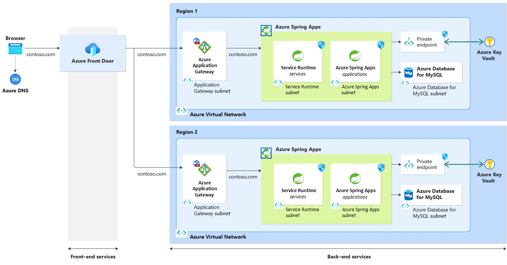

This reference architecture runs multiple Azure Spring Apps instances across regions in an active-active configuration.

This design builds on the [**Azure Spring Apps baseline architecture**](spring-apps-multi-zone.yml) that focuses on deploying a Java Spring Boot application to multiple [availability zones](/azure/availability-zones/az-overview#availability-zones) within a single region. The multiple zones spread the application workload across physically separate locations that can tolerate local failures within the Azure region.

However, if the entire region experiences an outage, the baseline will become unavailable to the user. The intent of this design build high availabily that can withstand a regional outage.

> [!TIP]
>  The architecture is backed by an [**example implementation**](https://github.com/Azure-Samples/azure-spring-apps-multi-region) that illustrates design choices that deal with the challenges of multi-region deployment, automation, and traffic routing.  

## Architecture

*Download a [Visio file](https://arch-center.azureedge.net/ha-zr-spring-apps-reference-architecture.vsdx) that contains this architecture diagram.*
### Components

The components of this architecture are same as the [**baseline architecture**](spring-apps-multi-zone-content.md#components). This list only highlights the added components. For product documentation about Azure services, see [Related resources](#related-resources).

- [Azure Front Door](https://azure.microsoft.com/products/frontdoor) acts as the global load balancer. It was chose because of its capability to deliver higher availability with lower latency, greater scale, and caching at the edge. 

### Workflow

1. The user accesses the application via browser by using the HTTP host name of the application, for example `www.contoso.com`. Azure DNS resolves the request for this host name to Azure Front Door.

1. Azure Front Door uses various load balancing configurations to forward the incoming requests to the public endpoint of Azure Application Gateway in each region. 

1. Application Gateway with integrated WAF inspects the request and forwards the allowed traffic to the IP address of the load balancer in the provisioned Azure Spring Apps instance. The Application Gateways are configured with the same custom domain name and TLS certificate name as Azure Front Door. Web Application Firewall allows incoming calls only from the specified Azure Front Door profile.

1. Application Gateway forwards the allowed traffic to the Azure Spring Apps load balancers.

1. The internal load balancer only routes the traffic from Application Gateway to the backend services.

1. Azure Spring Apps runs the application workload inside a virtual network in each region.

1. As part of processing the request, the application communicates with other Azure services inside the virtual network. For example, it reaches Key Vault for secrets and the database for storing state.

  The components inside the virtual networks use [private endpoints](/azure/private-link/private-endpoint-overview) to connect privately and securely to other Azure services. This solution uses private endpoints to connect to the databases and the key vaults.

   - The example uses [Azure Database for MySQL](/azure/mysql/single-server/overview) for data storage, but you can use any database.

   - [Azure Key Vault](/azure/key-vault/general/overview) stores application secrets and certificates. The microservices running in Azure Spring Apps use the application secrets. Azure Spring Apps, Application Gateway, and Azure Front Door use the certificates for host name preservation.

## Global distribution

How you set up this architecture is dependent on your business case. For example, if you're designing for global presence, you might want to use more than two regions. If you're designing for high availability, you can set up this architecture in an *active-active*, *active-passive with hot standby*, or *active-passive with cold standby* mode.

##### Active-active

All regions process requests simultaneously. Two regions exist, and both answer requests.

- The biggest challenge with this mode is keeping the data synchronization between the regions.
- Active-active is a costly approach, because you pay twice for almost all components.

This architecture uses active-active deployment in two regions.

##### Active-passive with hot standby

The secondary region doesn't receive any requests from Azure Front Door as long as the primary region is active. Make sure you replicate your application data from your primary to your secondary region. If a failure occurs in your primary region, you need to change the roles of your backend databases and fail over all traffic through Azure Front Door to your secondary region.

- It's easier to keep all data in sync, because failover is expected to take some time.
- This mode is as costly as active-active mode.
  
##### Active-passive with cold standby

The primary region has all the resources and serves traffic. The secondary region might have fewer components, or components with lower compute resources. The technology choices will depend on how much downtime is acceptable as per the business requirements. The extent of your secondary region setup also affects costs. Make sure that at least application data is present in the secondary region.

  - It's easier to keep the data synchronized because failover is expected to take some time.
  - This mode is the most cost effective, because you don't deploy all the resources to both regions.

If your entire solution setup uses templates, you can easily deploy a cold standby secondary region by creating its resources when needed. You can use Bicep/Azure Resource Manager (ARM) or Terraform templates, and automate infrastructure setup in a continuous integration/continuous deployment (CD/CD) pipeline. You should regularly test recreating your secondary region to make sure your templates are deployable in an emergency.

### Routing between regions

This example configures Azure Front Door with equal routing between the two deployment regions. Azure Front Door also provides other [traffic routing methods to origin](/azure/frontdoor/routing-methods). If you want to route clients to their closest origin, latency-based routing makes the most sense. If you're designing for an active/passive solution, priority-based routing is more appropriate.

This example uses an equal-weight load balancing rule between the two regions. Azure Front Door is configured with:

   - A custom domain and a transport-layer security (TLS) certificate that are named the same as the application host name, for example `www.contoso.com`.
   
   - One origin per region where the application is deployed. Each origin is an [Azure Application Gateway](/azure/application-gateway/overview) instance.

### Design patterns

This reference architecture uses the following cloud design patterns:

- [Geographical nodes (Geodes)](../../patterns/geodes.yml), where any region can service any request
- [Deployment Stamps](../../patterns/deployment-stamp.yml), where multiple independent copies of an application or component can deploy from a single template

### Backend database

This architecture uses a MySQL database for the backend database. You can also use other database technologies, like [Azure SQL Database](/azure/azure-sql/azure-sql-iaas-vs-paas-what-is-overview), [Azure Database for PostgreSQL](/azure/postgresql/single-server/overview), [Azure Database for MariaDB](/azure/mariadb/overview), or [Azure Cosmos DB](/azure/cosmos-db/introduction).

In many cases, you need to take data replication strategy into account when you design your application across regions, so users won't see stale data. The current architecture doesn't address data synchronization. For each of the database technologies, you should check how to best replicate and synchronize data between regions.

For example, the SQL Database [active geo-replication](/azure/azure-sql/database/active-geo-replication-overview) feature can provide a continuously synchronized, readable secondary database for a primary database. You can use this feature:

- If your secondary region is a cold standby that doesn't receive active requests.
- To fail over to if your primary region fails.
- To set up primary and secondary databases with private link connections to their respective regions, with [virtual network peering](/azure/virtual-network/virtual-network-peering-overview) between the two regions. For more information, see [Multiregion web app with private connectivity to a database](../../example-scenario/sql-failover/app-service-private-sql-multi-region.yml).

Azure Cosmos DB can [globally distribute](/azure/cosmos-db/distribute-data-globally) data by transparently replicating the data to all the regions in your Azure Cosmos DB account. You can also configure Azure Cosmos DB with [multiple write regions](/azure/cosmos-db/high-availability#multiple-write-regions). For more information, see [Geode pattern](../../patterns/geodes.yml) and [Globally distributed applications using Azure Cosmos DB](/azure/architecture/solution-ideas/articles/globally-distributed-mission-critical-applications-using-cosmos-db).

### Backend application service

This architecture can apply not only to Azure Spring Apps, but to any Azure platform as a service (PaaS) back end. For example, you can use this architecture with [Azure App Service](/azure/app-service), [Azure Kubernetes Service (AKS)](/azure/aks), or [Azure Container Apps](/azure/container-apps). The most important guideline when you use a different PaaS service is to properly configure host name preservation for the custom domain in the service.

### Reverse proxy setup

Azure Front Door does global load balancing between regions. This reverse proxy helps distribute the traffic if you deploy a workload to multiple regions. As an alternative, you can use [Azure Traffic Manager](/azure/traffic-manager/traffic-manager-overview). Traffic Manager is a DNS-based traffic load balancer that load balances only at the domain level.

The current solution uses two reverse proxies: Azure Front Door and Application Gateway. Application Gateway acts as a load balancer per region. Alternatively, you can remove Application Gateway from the setup if you address the following requirements:

- Because the Web Application Firewall is attached to the Application Gateway, you need to attach the firewall to the Azure Front Door service instead.

- You need a way to ensure that incoming calls originate only from the Azure Front Door instance. You can add the X-FDID header check and the Azure Front Door IP ranges check in the Spring Cloud Gateway app. For more information, see [Use Azure Front Door as the reverse proxy](spring-cloud-reverse-proxy.yml#scenario-4-using-azure-front-door-as-the-reverse-proxy).

For information about different reverse proxy scenarios, how to set them up, and their security considerations, see [Expose Azure Spring Apps through a reverse proxy](spring-cloud-reverse-proxy.yml).

### Key vault

This solution stores the application secrets and certificates in a single key vault. However, because application secrets and the certificates for host name preservation are different concerns, you might want to store them in separate key vaults. This alternative adds another key vault per region to your architecture.

## Solution details

This architecture describes a multiregion design for Azure Spring Apps, and describes how to load balance incoming application requests to the regions your application is deployed in. This architecture is useful when you want to:

- Have global reach for your application, for example availability in Europe, Asia, and the Americas.
- Bring the workload closer to the end user, making latency as low as possible.
- Increase the overall resilience and service level objective (SLO) of your application.
- Use a secondary region as a failover site for your primary region, and opt for an active/passive design.

### Potential use cases

Private connectivity to a backend database and high availability in multiple regions make this solution applicable to the financial, healthcare, and defense industries. The following applications and use cases can also benefit from multiregion deployment:

- Track customer spending habits and retail shopping behavior.
- Analyze manufacturing internet of things (IoT) data.
- Use smart technology to monitor and display meter data.
- Design a business continuity and disaster recovery plan for line-of-business (LoB) applications.
- Deploy mission-critical applications.
- Improve user experience by keeping applications available.

## Recommendations

The following recommendations apply for most scenarios. Follow these recommendations unless you have specific requirements that override them.

### Resource groups

Use Azure resource groups to manage resources deployed to each region as a single collection. Consider placing the primary region, secondary region, and Front Door into separate resource groups, as shown in the following diagram:

In this example:

- Azure Front Door is deployed in the `Application-shared` resource group.
- All resources hosted in West Europe are deployed in the `Application-weu` resource group.
- Resources hosted in East US are hosted in the `Application-eus` resource group.
- Resources hosted in Japan East are hosted in the `Application-jae` resource group.

Resources split up in this way share the same lifecycle and can be easily created and deleted together. Each region has its own set of resources, with a naming convention based on the region's name. Azure Front Door is in its own resource group, because it must exist even if regions are added or removed.

### Automated deployment

Automate your deployments as much as possible. You can automate infrastructure management in each region, and also automate application code deployments.

Automating infrastructure deployments guarantees that infrastructure in each region is configured the same, avoiding configuration drift between the regions. Infrastructure automation can also help you test failover and quickly bringing up a secondary region.

For application deployment, make sure your deployment systems target the multiple regions they need to deploy to. You can also use multiple regions in a [blue-green](../../example-scenario/blue-green-spring/blue-green-spring.yml) or canary deployment strategy. With these deployment strategies, you roll out new versions of applications to one region for testing, and to other regions after testing is successful.

## Considerations

These considerations implement the pillars of the Azure Well-Architected Framework, which is a set of guiding tenets that can be used to improve the quality of a workload. For more information, see [Microsoft Azure Well-Architected Framework](/azure/architecture/framework).

### Reliability

Reliability ensures your application can meet the commitments you make to your customers. For more information, see [Overview of the reliability pillar](/azure/architecture/framework/resiliency/overview).

This architecture explicitly increases the availability of your application over a single-region deployment. From an application workload viewpoint, you can use this architecture in either an active/passive or an active/active configuration. With an active/active approach, Azure Front Door routes traffic to both regions simultaneously.

### Security

Security provides assurances against deliberate attacks and the abuse of your valuable data and systems. For more information, see [Overview of the security pillar](/azure/architecture/framework/security/overview).

From a networking perspective, this architecture is locked down to allow incoming calls only from Azure Front Door. These calls are routed to the Application Gateway in each region. From the Application Gateway, the calls route to the backend Azure Spring Apps service. Communication from Azure Spring Apps to supporting services, like the backend database and the key vault, is also locked down by using private endpoints.

This architecture provides extra security by using a managed identity to connect between different components. For example, Azure Spring Apps uses a managed identity to connect to Key Vault. Key Vault allows Azure Spring Apps only minimal access to read the needed secrets, certificates, and keys.

You should also protect your virtual networks with [Azure DDoS Protection](/azure/ddos-protection/ddos-protection-overview). DDoS Protection, combined with application design best practices, provides enhanced mitigations to defend against distributed denial-of-service (DDoS) attacks.

### Cost optimization

Cost optimization is about looking at ways to reduce unnecessary expenses and improve operational efficiencies. For more information, see [Overview of the cost optimization pillar](/azure/architecture/framework/cost/overview).

This solution effectively doubles the cost of a single-region version. The following considerations can affect this estimate:

- The primary and secondary databases must use the same service tier. Otherwise, the secondary database might not keep up with replication changes.
- Significant cross-region traffic increases costs. Network traffic between Azure regions incurs charges.

To address costs:
- You can use scaled-down versions of resources like Azure Spring Apps and Application Gateway in the standby region, and scale up the resources only when the standby becomes active.
- You can deploy different applications and application types to a single instance of Azure Spring Apps.
- Azure Spring Apps supports application autoscaling triggered by metrics or schedules, which can improve utilization and cost efficiency.
- You can use Application Insights in [Azure Monitor](/azure/azure-monitor/overview) to lower operational costs. A comprehensive logging solution provides visibility for automation to scale components in real time. Analyzing log data can also reveal inefficiencies in application code that you can address to improve costs and performance.
- The alternative setup that uses only one reverse proxy can help save costs. You need to apply extra configuration to maintain the security of this alternative.
- An active/passive setup also saves costs. Whether active/passive is an option for you depends on your business case.
- A multizone setup in a single region can meet availability and resilience business needs and be more cost effective, because you only pay for most resources once.

All the services this architecture describes are pre-configured in an [Azure pricing calculator estimate](https://azure.com/e/b7876a2581f44431812751664b1249e1) with reasonable default values for a small scale application. You can update this estimate based on the throughput values you expect for your application.

### Operational excellence

Operational excellence covers the operations processes that deploy an application and keep it running in production. For more information, see [Overview of the operational excellence pillar](/azure/architecture/framework/devops/overview).

This architecture addresses the same aspects of operational excellence as the [single-region reference architecture for Azure Spring Apps](/azure/spring-cloud/reference-architecture). You can automate the full architecture rollout.

This architecture also follows the multiregion deployment recommendation in the [Release Engineering: Deployment](/azure/architecture/framework/devops/release-engineering-cd#consider-deploying-across-multiple-regions) section of the operational excellence pillar.

For operational excellence, integrate all components of this solution with Azure Monitor Logs to provide end-to-end insight into your application.

### Performance efficiency

Performance efficiency is the ability of your workload to scale to meet the demands placed on it by users in an efficient manner. For more information, see [Performance efficiency pillar overview](/azure/architecture/framework/scalability/overview).

This multiregion architecture in an active/active configuration is better suited than a single-region deployment to meet application demands, because it spreads the load across regions. If you configure Azure Front Door to route requests based on latency, users get better response times, because requests are routed to the regions closest to them.

Depending on your database setup, you might incur extra latency when data needs to be synchronized between regions. You can overcome this latency by using Azure Cosmos DB with a more relaxed [consistency level](/azure/cosmos-db/consistency-levels).

This architecture has several components that can autoscale based on metrics:

- Azure Front Door can autoscale based on demand. You can use other Azure Front Door features, like traffic acceleration and caching capabilities, to bring assets closer to your end users.
- Application Gateway supports autoscaling. For more information, see [Scale Application Gateway v2 and WAF v2](/azure/application-gateway/application-gateway-autoscaling-zone-redundant).
- Azure Spring Apps also supports autoscaling. For more information, see [Set up autoscale for applications](/azure/spring-apps/how-to-setup-autoscale).

## Deploy this scenario

A deployment for this reference architecture is available at [Azure Spring Apps multiregion reference architecture](https://github.com/Azure-Samples/azure-spring-apps-multi-region) on GitHub. The deployment uses Terraform templates. To deploy the architecture, [follow the step-by-step instructions](https://github.com/Azure-Samples/azure-spring-apps-multi-region#getting-started).

## Contributors

*This article is maintained by Microsoft. It was originally written by the following contributors.*

Principal author:

 - [Gitte Vermeiren](https://www.linkedin.com/in/gitte-vermeiren-b1b2221) | FastTrack for Azure Engineer

Other contributors:

 - [Jelle Druyts](https://www.linkedin.com/in/jelle-druyts-0b76823) | FastTrack for Azure Engineer
 - [Christof Claessens](https://www.linkedin.com/in/christofclaessens) | FastTrack for Azure Engineer

*To see non-public LinkedIn profiles, sign in to LinkedIn.*

## Next steps

- [What are Azure regions and availability zones?](/azure/reliability/availability-zones-overview)
- [Azure Spring Apps reference architecture](/azure/spring-cloud/reference-architecture)
- [Best practices for Azure Front Door](/azure/frontdoor/best-practices)
- [What is Azure Web Application Firewall on Azure Application Gateway?](/azure/web-application-firewall/ag/ag-overview)

## Related resources

- [Expose Azure Spring Apps through a reverse proxy](spring-cloud-reverse-proxy.yml)
- [High-availability blue/green deployment](../../example-scenario/blue-green-spring/blue-green-spring.yml)
- [Preserve the original HTTP host name between a reverse proxy and its back-end web application](../../best-practices/host-name-preservation.yml)
- [Multiregion web app with private connectivity to a database](../../example-scenario/sql-failover/app-service-private-sql-multi-region.yml)

#### Multi-region deployment

To increase application resilience and reliability, you can alternatively deploy the application to multiple regions. If you do, add an additional [Azure Front Door](/azure/frontdoor/front-door-overview) or [Azure Traffic Manager](/azure/traffic-manager/traffic-manager-overview) service to load balance requests to your applications across regions.

However, multi-region deployment doubles the cost of your setup, because you duplicate the full setup to a secondary region. For this reason, the choice is often made to provide an active-passive setup, where only one region is active and deployed. In this case, you add a global load balancer to the multi-region setup to provide an easy way of failing over your workloads after a secondary region becomes active. Whether active-active or active-passive is the best choice for your workload depends on the availability requirements you have for your application.

The biggest challenge with a multi-region setup is replicating the data for your application between multiple regions. This isn't an issue with the multi-zone setup. Azure availability zones are connected by a high-performance network with a round-trip latency of less than 2 ms. This latency is OK for most applications.

You can also combine a multi-zone solution with a multi-region solution.

> [!IMPORTANT]
> For business-critical workloads, we recommend combining zone redundancy and regional redundancy to achieve maximum reliability and availability, with zone-redundant services deployed across multiple Azure regions.
> For more information, refer to the [Global distribution](/azure/architecture/framework/mission-critical/mission-critical-application-design#global-distribution) section of the mission-critical design methodology, and the [Mission-critical baseline architecture](/azure/architecture/reference-architectures/containers/aks-mission-critical/mission-critical-intro).
> You can also use the [Deploy Azure Spring Apps to multiple regions guidance](/azure/architecture/reference-architectures/microservices/spring-apps-multi-region) for an automated setup across regions.

