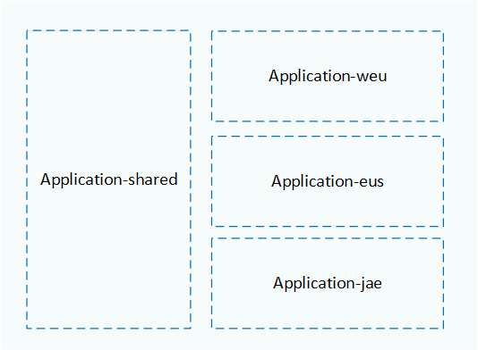

This reference architecture runs multiple Azure Spring Apps instances across regions in an active-active configuration.

This design builds on the [**Azure Spring Apps baseline architecture**](spring-apps-multi-zone.yml). The baseline deploys a Java Spring Boot application to multiple [availability zones](/azure/availability-zones/az-overview#availability-zones) within a single region. The multiple zones spread the application workload across separate locations that it can tolerate local failures within the Azure region.

However, if the entire region experiences an outage, the baseline will become unavailable to the user. The intent of this design is to build high availability that can withstand a regional outage. 

This architecture was designed to meet these goals:

- Increase the overall resilience and service level objective (SLO) of the application.
- Have global reach for the application.
- Bring the workload closer to the end user, making latency as low as possible.
- Use a secondary region as a failover site for the primary region, and opt for an active-passive design.

To increase application resilience and reliability, you can deploy the application to multiple regions. For this design, you would need a global router to load balance requests to your applications across regions. The global router chosen for this architecture also addresses other goals. 

The biggest challenge with a multi-region setup is replicating the data for your application between multiple regions. This isn't an issue with the multi-zone setup. Azure availability zones are connected by a high-performance network with a round-trip latency of less than 2 ms. This latency is OK for most applications.

> [!TIP]
>  The architecture is backed by an [**example implementation**](https://github.com/Azure-Samples/azure-spring-apps-multi-region) that illustrates design choices that deal with the challenges of multi-region deployment, automation, and traffic routing.  

## Architecture

:::image type="content" source="./_images/spring-apps-reference-architecture-multi-region.svg" alt-text="Diagram that shows a multi-region Azure Spring Apps reference architecture." lightbox="./_images/spring-apps-reference-architecture-multi-region.png":::

### Components

The components of this architecture are same as the [**baseline architecture**](/azure/architecture/web-apps/spring-apps/spring-apps-multi-zone#components). This list only highlights the changes to that architecture. For product documentation about Azure services, see [Related resources](#related-resources).

- **Azure Front Door** acts as the global load balancer. It was chosen because of its capability to deliver higher availability with lower latency, greater scale, and caching at the edge. 

### Workflow

1. The user sends a request to the HTTP host name of the application, for example `www.contoso.com`. Azure DNS resolves the request for this host name to Azure Front Door.

1. Azure Front Door uses various load balancing configurations to forward the incoming requests to the public endpoint of Azure Application Gateway in each region. The Application Gateways are configured with the same custom domain name and TLS certificate name as Azure Front Door. 

1. Application Gateway with integrated Web Application Firewall (WAF) inspects the request. WAF allows incoming requests only from the specified Azure Front Door profile.

1. Application Gateway forwards the allowed traffic to the IP address of the load balancer in the provisioned Azure Spring Apps instance. 

1. The internal load balancer only routes the traffic from Application Gateway to the backend services. These services are hosted in Azure Spring Apps instance inside a virtual network in each region.

1. As part of processing the request, the application communicates with other Azure services inside the virtual network. For example, it reaches Key Vault for secrets and the database for storing state.

## Global distribution

If you're designing for high availability, you can set up this architecture in an *active-active*, *active-passive with hot standby*, or *active-passive with cold standby* mode.

That choice depends on your business requirements. This architecture uses active-active deployment in two regions because the organization wants to have a global presence with high Uptime SLA (Service Level Agreement). If you're running mission-critical applications and want higher availability, you need to use more than two regions. 

> [!NOTE] 
> 
> Multi-region deployment doubles the cost of workload because the full setup is duplicated to a secondary region. For this reason, the choice is often made to provide an active-passive setup, where only one region is active and deployed. In this case, you add a global load balancer to the multi-region setup to provide an easy way of failing over your workloads after a secondary region becomes active. 
>
>Whether active-active or active-passive is the best choice for your workload depends on the availability requirements you have for your application.

##### Active-active

All regions process requests simultaneously. 

- The biggest challenge with this mode is keeping the data synchronization between the regions.
- Active-active is a costly approach, because you pay twice for almost all components.

##### Active-passive with hot standby

The secondary region doesn't receive any requests from Azure Front Door as long as the primary region is active. Make sure you replicate your application data from your primary to your secondary region. If a failure occurs in your primary region, you need to change the roles of your backend databases and fail over all traffic through Azure Front Door to your secondary region.

- It's easier to keep all data in sync, because failover is expected to take some time.
- This mode is as costly as active-active mode.
  
##### Active-passive with cold standby

The primary region has all the resources and serves traffic. The secondary region might have fewer components, or components with lower compute resources. The technology choices depend on how much downtime is acceptable as per the business requirements. The extent of your secondary region setup also affects costs. Make sure that at least application data is present in the secondary region.

  - It's easier to keep the data synchronized because failover is expected to take some time.
  - This mode is the most cost effective, because you don't deploy all the resources to both regions.

If your entire solution setup uses templates, you can easily deploy a cold standby secondary region by creating its resources when needed. You can use Bicep/Azure Resource Manager (ARM) or Terraform templates, and automate infrastructure setup in a continuous integration/continuous deployment (CI/CD) pipeline. You should regularly test recreating your secondary region to make sure your templates are deployable in an emergency.

[Deployment Stamps](../../patterns/deployment-stamp.yml) pattern is recommended because multiple independent copies of an application or component can be deployed from a single template to multiple regions.

> [!IMPORTANT]
> For mission-critical workloads, we recommend combining zone redundancy and regional redundancy to achieve maximum reliability and availability, with zone-redundant services deployed across multiple Azure regions.
> For more information, see the [Global distribution](/azure/architecture/framework/mission-critical/mission-critical-application-design#global-distribution) section of the mission-critical design methodology, and the [Mission-critical baseline architecture](/azure/architecture/reference-architectures/containers/aks-mission-critical/mission-critical-intro).
> You can also use the [Deploy Azure Spring Apps to multiple regions guidance](/azure/architecture/reference-architectures/microservices/spring-apps-multi-region) for an automated setup across regions.

## Routing between regions

This reference architecture uses [Geographical nodes (Geodes)](/azure/architecture/patterns/geodes), where any region can service any request. 

Azure Front Door is configured with equal routing between the two deployment regions. Front Door also provides other [traffic routing methods to origin](/azure/frontdoor/routing-methods). If you want to route clients to their closest origin, latency-based routing makes the most sense. If you're designing for an active-passive solution, priority-based routing is more appropriate.

This example uses an equal-weight load balancing rule between the two regions. Azure Front Door is configured with:

   - A custom domain and a transport-layer security (TLS) certificate that is named the same as the application host name, for example `www.contoso.com`.
   
   - One origin per region where the application is deployed. Each origin is an [Azure Application Gateway](/azure/application-gateway/overview) instance.

##### Resource group layout

Use Azure resource groups to manage resources deployed to each region as a single collection. Consider placing the primary region, secondary region, and Front Door into separate resource groups, as shown in the following diagram:

In this example:

- Azure Front Door is deployed in the `Application-shared` resource group.
- All resources hosted in West Europe are deployed in the `Application-weu` resource group.
- Resources hosted in East US are hosted in the `Application-eus` resource group.
- Resources hosted in Japan East are hosted in the `Application-jae` resource group.

Resources in the same resource group share the same lifecycle and can be easily created and deleted together. Each region has its own set of resources in a dedicated resource group, with a naming convention based on the region's name. Azure Front Door is in its own resource group, because it must exist even if regions are added or removed.

##### Reverse proxy setup

Azure Front Door does global load balancing between regions. This reverse proxy helps distribute the traffic if you deploy a workload to multiple regions. As an alternative, you can use [Azure Traffic Manager](/azure/traffic-manager/traffic-manager-overview). Traffic Manager is a DNS-based traffic load balancer that load balances only at the domain level.

Azure Front Door has integrated content delivery networks (CDNs) that delivers content from Microsoft’s global edge network with points of presence (PoPs) distributed around the world.

The current solution uses two reverse proxies to maintain consistency with the baseline architecture. Azure Front Door is the global router. Application Gateway acts as a load balancer per region. In most cases, you won't need this setup. You can remove Application Gateway if you address the following requirements:

- Because the Web Application Firewall (WAF) is attached to the Application Gateway, you need to attach WAF to the Azure Front Door service instead.

- You need a way to ensure that incoming calls originate only from your Azure Front Door instance. You can add the X-Azure-FDID header check and the Azure Front Door IP ranges check in the Spring Cloud Gateway app. For more information, see [Use Azure Front Door as the reverse proxy](spring-cloud-reverse-proxy.yml#scenario-4-using-azure-front-door-as-the-reverse-proxy).

For information about different reverse proxy scenarios, how to set them up, and their security considerations, see [Expose Azure Spring Apps through a reverse proxy](spring-cloud-reverse-proxy.yml).

##### Backend database

For multi-region deployment, you need to have a data replication strategy. When the application is available across regions, data should be synchronized so that users don't see stale data. 

The current architecture a MySQL database for the backend database. It doesn't address data synchronization. When you choose a database technology, check how to best replicate and synchronize data between regions.

For example, the Azure SQL Database has an [active geo-replication](/azure/azure-sql/database/active-geo-replication-overview) feature that can provide a continuously synchronized, readable secondary database for a primary database. 
You can use this feature:

- If your secondary region is a cold standby that doesn't receive active requests.
- To fail over to if your primary region fails.
- To set up primary and secondary databases with private link connections to their respective regions, with [virtual network peering](/azure/virtual-network/virtual-network-peering-overview) between the two regions. For more information, see [Multiregion web app with private connectivity to a database](../../example-scenario/sql-failover/app-service-private-sql-multi-region.yml).

Another alternative is Azure Cosmos DB. It can [globally distribute](/azure/cosmos-db/distribute-data-globally) data by transparently replicating the data to all the regions in your Azure Cosmos DB account. You can also configure Azure Cosmos DB with [multiple write regions](/azure/cosmos-db/high-availability#multiple-write-regions). For more information, see [Geode pattern](../../patterns/geodes.yml) and [Globally distributed applications using Azure Cosmos DB](/azure/architecture/solution-ideas/articles/globally-distributed-mission-critical-applications-using-cosmos-db).

## Automated deployment

Automate your infrastructure deployment and application code deployments, as much as possible. 

Automating infrastructure deployments guarantees that infrastructure is configured identically, avoiding configuration drift (for example, between regions). Infrastructure automation can also test fail over operations.

For application deployment, make sure your deployment systems target the multiple regions they need to deploy to. You can also use multiple regions in a [blue-green](blue-green-spring.yml) or canary deployment strategy. With these deployment strategies, you roll out new versions of applications to one region for testing, and to other regions after testing is successful.

You can also use a [blue-green](/azure/architecture/example-scenario/blue-green-spring/blue-green-spring) or canary deployment strategy.

## Performance and scalability

This architecture is better suited than the [**baseline architecture**](./spring-apps-multi-zone.yml) to meet application demands, because it spreads the load across regions. If you configure Azure Front Door to route requests based on latency, users get better response times, because requests are routed to the regions closest to them.

Depending on your database setup, you might incur extra latency when data needs to be synchronized between regions. You can overcome this latency by using Azure Cosmos DB with a more relaxed [consistency level](/azure/cosmos-db/consistency-levels).

This architecture has several components that can autoscale based on metrics:

- Azure Front Door can autoscale based on demand. You can use other Azure Front Door features, like traffic acceleration and caching capabilities, to bring assets closer to your end users.
- Application Gateway supports autoscaling. For more information, see [Scale Application Gateway v2 and WAF v2](/azure/application-gateway/application-gateway-autoscaling-zone-redundant).
- Azure Spring Apps also supports autoscaling. For more information, see [Set up autoscale for applications](/azure/spring-apps/how-to-setup-autoscale).

## Cost considerations

This solution effectively doubles the cost estimates of the [**baseline architecture**](/azure/architecture/web-apps/spring-apps/spring-apps-multi-zone#cost-considerations). Main cost drivers for this architecture are as follows:

- The primary and secondary databases must use the same service tier. Otherwise, the secondary database might not keep up with replication changes.
- Significant cross-region traffic increases costs. Network traffic between Azure regions incurs charges.

To address costs:
- You can use scaled-down versions of resources like Azure Spring Apps and Application Gateway in the standby region, and scale up the resources only when the standby becomes active.
- An active-passive setup also saves costs. Whether active/passive is an option for you depends on your business case.
- A multizone setup in a single region can meet availability and resilience business needs and be more cost effective, because you only pay for most resources once.
- The alternative setup that uses only one reverse proxy can help save costs. You need to apply extra configuration to maintain the security of this alternative.

The cost of services was estimated in [Azure pricing calculator](https://azure.com/e/414c5e0b15494e5081cc9f008d82fdaa) with reasonable default values for a small-scale application. You can update this estimate based on the throughput values you expect for your application.

## Other considerations

The design considerations for the [**baseline architecture**](spring-apps-multi-zone.yml) still apply in this use case. Review these points in the context of this architecture: 

- **Network security**. Incoming calls this architecture is locked down to allow incoming calls only from Azure Front Door. These calls are routed to the Application Gateway in each region. From the Application Gateway, the calls route to the backend Azure Spring Apps service. Communication from Azure Spring Apps to supporting services, like the key vault, is also locked down by using private endpoints. The most important guideline when you use a different PaaS service is to properly configure host name preservation for the custom domain in the service.

  > For details, see [Baseline architecture: Network security](/azure/architecture/web-apps/spring-apps/spring-apps-multi-zone#network-security)

- **Identity and access management**. Access is further secured through managed identities to connect between different components. For example, Azure Spring Apps uses a managed identity to connect to Key Vault.

  > For details, see [Baseline architecture: Identity and access management](/azure/architecture/web-apps/spring-apps/spring-apps-multi-zone#identity-and-access-management)

- **Monitoring**. Add instrumentation and enable distributed tracing to collect data from the application. Combine that data source with platform diagnostics to get an end-to-end insight into your application. 

  > For details, see [Baseline architecture: Monitoring](/azure/architecture/web-apps/spring-apps/spring-apps-multi-zone#monitoring).

- **Secret management**. This solution stores the application secrets and certificates in a single key vault. 

  > For details, see [Baseline architecture: Secret management](/azure/architecture/web-apps/spring-apps/spring-apps-multi-zone#secret-management).

## Deploy this scenario

A deployment for this reference architecture is available at [Azure Spring Apps multiregion reference architecture](https://github.com/Azure-Samples/azure-spring-apps-multi-region) on GitHub. The deployment uses Terraform templates. 

To deploy the architecture, [follow the step-by-step instructions](https://github.com/Azure-Samples/azure-spring-apps-multi-region#getting-started).

## Contributors

*This article is maintained by Microsoft. It was originally written by the following contributors.*

Principal author:

 - [Gitte Vermeiren](https://www.linkedin.com/in/gitte-vermeiren-b1b2221) | FastTrack for Azure Engineer

## Next steps

To integrate this workload with shared services managed by central teams in your organization, deploy it in Azure application landing zone. 

> [!div class="nextstepaction"]
> [Azure Spring Apps integrated with landing zones](spring-apps-landing-zone.yml)

## Related resources

For documentation on the Azure services and features used in this architecture, see these articles.

- [Azure Spring Apps](/azure/spring-apps/)
- [Azure Front Door](/azure/frontdoor/)
- [Azure Application Gateway v2](/azure/application-gateway/overview-v2)
- [Azure Database for MySQL](/azure/mysql/overview)
- [Azure Key Vault](/azure/key-vault/)
- [Azure DNS](/azure/dns/dns-overview)
- [Azure Web Application Firewall](/azure/web-application-firewall/overview)
- [Azure Private Link](/azure/private-link/private-link-overview)
- [Managed identities](/azure/active-directory/managed-identities-azure-resources/overview)

We recommend these guides to get deeper understanding around the choices made in this architecture:

- [Expose Azure Spring Apps through a reverse proxy](spring-cloud-reverse-proxy.yml)
- [High-availability blue/green deployment](./blue-green-spring.yml)
- [Preserve the original HTTP host name between a reverse proxy and its back-end web application](../../best-practices/host-name-preservation.yml)
- [Multiregion web app with private connectivity to a database](../../example-scenario/sql-failover/app-service-private-sql-multi-region.yml)

This architecture has been designed keeping alignment with the pillars of the [Microsoft Azure Well-Architected Framework](/azure/architecture/framework). We recommend that you review the design principles for each pillar.

