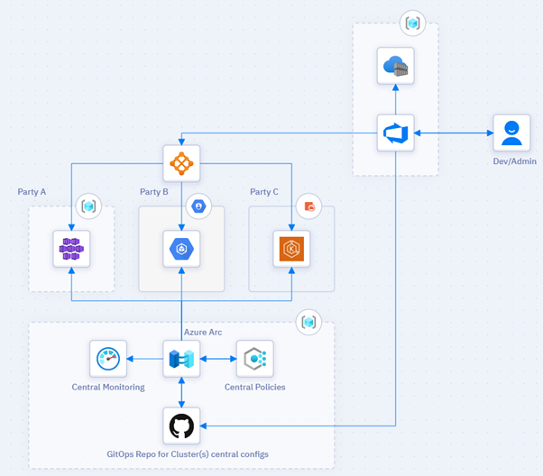

# Multi-cloud Distributed Ledger (DLT)

Introduction
Blockchain and DLT networks are multi-party systems. Each party has their own tools, methodology and probably preferred cloud provider. Although cloud Blockchain-as-a-service offerings (BaaS) can save a lot of Infrastructure management efforts, it assumes that all party will be in the same Cloud and it sometimes have limits to the number of nodes in a single consortium.

## Potential use cases
Imagine two parties join forces to build a blockchain network between them. ‘Party A’ uses Azure, and “Party B” uses their own private cloud infrastructure or other cloud provider. 
In this scenario, managed blockchain is only useful if all party join the same infrastructure. For these scenarios, we need to build a standard platform across different infrastructure. 
This platform must have standard visibility, operations, and compliance across a wide range of resources and locations regardless of the hosting infrastructure.

The benefits of using this approach are:
-	Supports heterogeneous deployments in a multi-cloud, multi-owner model where each node is completely owned and managed by separate organizations.
-	Centrally manage and monitor the Network status and compliance.
 
## Architecture
This reference Architecture provides a cloud agnostic & multi-party DLT Network. It Supports heterogeneous deployments in a multi-cloud, multi-owner model where each owner can host their nodes anywhere but be part of the network.

This architecture uses a three-party example, each party host their nodes in different location. As below:
-	Party A: Uses Azure Kubernetes Service.
-	Party B: Uses GCP GKE.
-	Party C: Uses AWS GKE.

  

 

### Components
Kubernetes as the standard infrastructure to host both the Ledger and the Application.
-	This architecture assumes you have three managed Kubernetes clusters in Azure AKS, AWS EKS and GCP GKE already. You can have your cluster virtually anywhere.

Blockchain Automation Framework (BAF). BAF provides a consistent means by which developers can deploy production-ready distributed networks across public and private cloud providers.
-	BAF is a great framework for managing the deployment but it doesn’t cater for central infrastructure management and monitoring.
-	BAF currently support the following DLT: Quorum, Corda & Hyperledger.

Azure Arc enabled Kubernetes to centrally manage Kubernetes clusters in any location. 
-	Azure Arc enabled Kubernetes works with any Cloud Native Computing Foundation (CNCF) certified Kubernetes cluster such as AKS-engine on Azure, AKS-engine on Azure Stack Hub, GKE, EKS and VMware vSphere cluster.

Ambassador API Gateway for cross-node communication.

HashiCorp Vault. BAF use it as the certificate and key storage solution; so to use BAF, at least one Vault server should be available. BAF recommends one Vault per organization for production-ready projects.

Shared Artifacts:
-	Azure DevOps to provide Application & Infrastructure and lifecycle management.
-	Ansible Controller on an Azure Linux VM. This will be used as custom CI/CD agent on Azure DevOps.
-	Docker container registry: to pull ledger specific images.
-	Azure Container registry. To store & share private application-related container images.

## Considerations
Although Kubernetes clusters can be managed and monitor via Azure Arc, each cluster must cater for High availability, scalability, and disaster recovery independently.
For Azure AKS best practices, we recommend considering AKS Baseline. Similar best practices guidance can be found for other cloud providers.

### Security
Cross-node communication but you may use cloud native API Gateway over internet. You may use cloud native API Gateway like Azure API Management or alternatively use External-DNS like AzureDNS.

## Deploy this scenario
1.	Create the Kubernetes clusters.
o	Onboard existing Cluster to Azure Arc.
o	Create & Onboard Amazon Elastic Kubernetes Service.
o	Create & Onboard Google Kubernetes Engine.
2.	Create an Azure DevOps Org and project
3.	Create and Ansible Controller VM in Azure
4.	Follow steps for installing and configuring BAF Prerequisites

## Pricing
For Azure Resources costs, you can use Azure pricing calculator.
Note: Azure Arc enabled Kubernetes In the current preview phase. Azure Arc enabled Kubernetes is offered at no additional cost.

